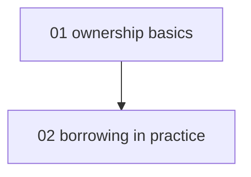

# Vault conventions (canonical)

The full spec for how tenant content hangs together as an Obsidian vault. Generation skills follow this when writing; vault operations enforce it after.

## Naming and layout

- Note filenames are kebab-case and stable once created (wikilinks bind to them). Lessons keep their `NN-` ordering prefix; hubs are `<slug>-hub.md`; the tenant home note is `home.md` at the vault root.
- Courses are grouped by domain, and the grouping is **identical to the community tier's**: a course sits at `<domain>/<course-slug>/` here exactly as a pack sits at `content/community/<domain>/<slug>/`. `<domain>` comes from the same closed vocabulary in [DOMAINS.md](../../../../content/community/DOMAINS.md) - one list, both tiers, so a course keeps its place in the tree whether it is being studied privately or published, and adoption is a straight mirror copy rather than a reshuffle.
- The vault tree mirrors the course structure - no separate "notes folder"; lessons ARE the notes:

```
content/tenants/<tenant>/
  home.md                      tenant home note (top of the graph)
  todos.md                     shared queue (see todo-format.md)
  groups.yml                   course groups (see below; agent- and hand-edited, never app-written)
  sources/                     user-supplied materials (never rewritten by agents)
  progress/                    ledger.jsonl, mastery.yml (data, not notes; no wikilinks needed)
  <domain>/                    one of DOMAINS.md's slugs; same vocabulary as content/community/
    <course-slug>/
      profile.md               the contract (wikilinks allowed in prose)
      course.yml               manifest (regenerable, never hand-edited)
      <course-slug>-hub.md     course hub / map of content
      modules/NN-slug/
        module.yml
        NN-lesson-name.md      lessons = notes
```

`progress/`, `sources/`, and `insights/` sit beside the domain directories, never inside one - none of their names is a domain slug, so the two never collide. `tools/validate.ts`'s `course-layout` check enforces the shape and the vocabulary; the app reads a course sitting directly at the vault root as a pre-grouping vault rather than hiding it, so an unmigrated vault still renders while validate names what to move.

## Link rules

1. Wikilinks for everything intra-vault; `[[target|display text]]` when the filename reads poorly inline. External URLs use standard markdown links.
2. Link at first meaningful use in a note, not every mention.
3. A link is a promise: following it should help the reader here. "Related-ish" links dilute the graph - leave them out.
4. Renaming a note means updating every inbound link in the same operation (Obsidian automates this; agents grep and fix).
5. Broken wikilinks are permitted transiently as authoring intent ("[[borrow-checker-deep-dive]] - planned"), but each one must be mirrored by a todo, so intent never silently rots.

## Hub anatomy

The `meno:derived` markers are the contract for refreshes: regenerate only between them; everything outside is human territory, preserved verbatim.

**Tenant home note (`home.md`):**

````markdown
# Home

<!-- meno:derived:start -->
Now learning: [[software-engineering/rust-for-backend/rust-for-backend-hub|Rust for backend]]
- [[software-engineering/rust-for-backend/rust-for-backend-hub|Rust for backend]] - module 1 of 5, next review 2026-08-07
<!-- meno:derived:end -->

## Notes to self
(hands off during refreshes)
````

**Course hub (`<slug>-hub.md`):** the derived block holds (a) a Mermaid `graph TD` of module dependencies and (b) one entry per module. A module whose lessons have no bodies yet appears as plain text with status - "02 borrowing in practice (planned)" - never as a broken wikilink; once its lessons exist, the entry becomes wikilinks to them, each with a one-line why. This skeleton-time rule is the spec `generate-curriculum` builds against, and it generalizes to the pure-skeleton state: immediately after skeleton generation, before any module has bodies, every entry is plain text with status.

````markdown
# Rust for backend - map

<!-- meno:derived:start -->

**01 ownership basics** (generated)
- [[modules/01-ownership-basics/01-ownership|Ownership]] - why moves beat copies
**02 borrowing in practice** (planned)
<!-- meno:derived:end -->

## Connects to
<!-- meno:connects:start -->
- [[git-fundamentals-hub|Git fundamentals]] - merging to the default branch is what triggers a redeploy
<!-- meno:connects:end -->

## My notes
(human territory; never regenerated)
````

## Connects to (`## Connects to`, cross-course edges)

A hub's own section for the cross-course edges the knowledge-graph view (`docs/specs/graph.md`)
draws as thick `connection` edges - the connective tissue no manifest carries, because these are
edges between courses, not within one. The heading sits ABOVE the marker pair,
`<!-- meno:connects:start -->` / `<!-- meno:connects:end -->`, exactly as a hub's `# Title` sits
above `meno:derived:start`; the block itself sits AFTER the `meno:derived` block and ABOVE the
human "My notes" section, as in the example above.

Grammar, one bullet per line, machine-checked by `lib/connects.ts` and `tools/validate.ts`'s
`connects` check:

```markdown
- [[target-hub|Title]] - one-line reason
```

- `target-hub` is the other course's hub note, resolved the same way any wikilink resolves
  (unique basename wins). A target `tools/validate.ts` cannot resolve is an error; a heading
  anchor (`[[hub#section]]`) is not a note and is malformed.
- The reason is required, one line, and says *why* the two courses connect - not "related",
  the actual causal or structural link a learner would want surfaced.
- **A bullet requires a dependency, not a shared subject.** The test: name the module in the
  other course a learner would be stuck in without this one, and put that module in the reason.
  A pair that cannot pass it gets no bullet in either hub. Two courses that merely meet at a
  topic do not qualify however true the observation - "the token bill measured in one course
  lands on the hosting bill in the other" is a real structural link and still not a bullet,
  because neither course's work stops without the other. Adjacency belongs in a hub's ordinary
  prose, where the wikilink draws a thin `reference` edge and says the same thing without
  claiming more. The accented `connection` edge means one thing, and it stops meaning it the
  moment everything qualifies: a graph where every course touches every other is the same
  picture as no graph at all.
- **Edges are undirected, and reciprocating is preferred.** Write the bullet in both hubs. One
  bullet is enough for the graph - it draws a single edge either way, and a second bullet
  naming the same pair collapses into that same edge rather than doubling it - but the vault
  is an Obsidian vault first, and there a one-sided link is invisible from the other note.
  Someone reading the hosting hub would never learn it connects to git. So a pair where only
  one hub names the other is a validate warning, not an error: the graph is fine, the vault
  is the thing that is poorer for it. Reciprocating clears the warning. The two bullets may
  word the reason differently, and often should - each says why the connection matters when
  you are standing in that course.
- **`generate-curriculum` must never touch this block.** It owns `meno:derived`, which is
  single-course scoped by design; a cross-course edge is invisible to a single-course
  regeneration, so a generator that "refreshed" this block would silently wipe edges it has no
  way to see. Only `second-brain`, following the **Connect courses** operation below, writes it.
- Refreshed only on an explicit `second-brain` sweep - a new course is invisible in the graph
  view until someone asks for one. Preferred over a writer that would clobber judgment it
  cannot reproduce from a manifest.

## Course groups (`groups.yml`, canonical)

A course already has a place in the tree - it sits under a domain from the closed vocabulary
above - and the app groups the course list by that domain for free, with no setup at all.
`groups.yml` exists for what a domain cannot say: the learner's own words. "Version Control"
and "Software Fundamentals" are not domains and never will be, and a learner reorganizing their
own shelf should not have to file a pull request against a shared vocabulary to do it.

So there are two layers, and the rule between them is one line: **an explicit group always
wins, and a course no group claims falls back to its domain.** `groups.yml` at the vault root
holds the explicit layer - free-form groups the learner names, each holding course slugs in
display order. Schema: [schemas/groups.schema.json](../../../schemas/groups.schema.json).

```yaml
schema_version: 1
groups:
  - id: version-control          # kebab-case, derived from the title at creation, stable after
    title: Version Control       # what the learner sees; renaming changes this, never the id
    courses:                     # course slugs as course.yml declares them, not directory paths
      - git-fundamentals
```

Five rules make it safe to hand-edit, and they are the reason it is a registry rather than a
field on each course:

1. **A group is a label, never a folder.** Membership changes nothing about a course: no file
   moves, no wikilink breaks, no manifest is rewritten. This is also why membership cannot live
   in `course.yml` - that file is a derived view, regenerated wholesale from the module
   manifests, so anything hand-set there is lost on the next regeneration.
2. **Every course belongs to at most one group, and needs none.** A course no group names is
   listed under its domain directory - the common case, and not an error. *Ungrouped* is left
   for the one case with nothing to fall back to: a course still sitting at the vault root from
   before the domain layout.
3. **The walk is the truth about what exists.** A slug here that is no longer a course drops out
   of the rendered list with a warning; nothing auto-deletes and nothing breaks.
4. **Deleting a group deletes the grouping only.** Its courses fall back to their domains, the
   same spirit as `todos.md`, where lines are checked off or parked but never removed.
5. **Two writers, one file.** An agent writes it and Obsidian or a text editor edits it by hand;
   the study app reads it and never writes it. That means there is no content-hash guard between
   you and a human editing the same file, so read it immediately before you write it and write it
   whole - the same discipline the app used to enforce for itself, now yours to keep.

**Group operations**: create a group, rename one, delete one (courses fall back to
their domains), and file or move a course. Since v1.6 these are the only way a group changes at
all; the app has no group editing surface. Filing is for when the domain is genuinely the wrong
answer - a course whose domain already reads well needs no group at all, and an explicit group
that merely restates its domain is noise. Before creating a group, read the existing ones and
reuse one if it fits; the vocabulary is deliberately open, unlike
[content/community/DOMAINS.md](../../../content/community/DOMAINS.md)'s closed domain list,
because one learner curating their own shelf is not the multi-contributor commons that a closed
vocabulary exists to protect. State the assignment; never file a course silently.

The tenant home note's derived block groups its course list the same way, recomputed from
`groups.yml` at every hub refresh - derived, never a second copy to keep in sync.

## Tags (two closed namespaces)

Vault tags on notes: `#stale` (content flagged by the review_after sweep), `#todo-linked` (note referenced by an open todo), `#hand-made` (course or note not generated). Todo hashtags inside `todos.md` - the seven kind tags (`#course`, `#content-fix`, `#vault`, `#feature`, `#bug`, `#study`, `#admin`) and the two audience tags (`#for-agent`, `#for-me`) - see todo-format.md, are a separate, equally closed namespace scoped to that one file; Obsidian will show both families in its tag pane, which is expected. Propose additions to either list rather than inventing tags ad hoc; topics are links, not tags.

## Graph hygiene invariants

- Every note reachable from `home.md` (the no-orphans rule).
- Every lesson wikilinked from its course hub's derived block.
- Two or more lateral links per new note is the norm; a note with zero laterals should be rare and deliberate.
- `sources/` files may be linked TO but are never edited; `progress/` files are data, not notes.
