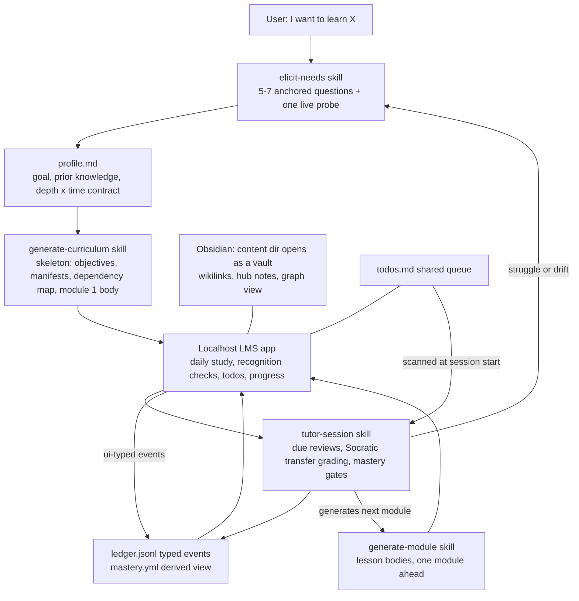

# Meno - Build Plan

*Status: v1 shipped 2026-08-05 - all eight phases complete (see PROGRESS.md and docs/specs/). The decision record and phase plan below are the historical record the build followed. Evidence base: [docs/RESEARCH.md](docs/RESEARCH.md).*

## What Meno is

Meno is a learning system that lives entirely in a git repository. An AI coding agent (Claude Code first-class, any capable agent CLI supported) interviews you to pin down what you actually need to learn, generates a cited curriculum sized to your goal and time budget, and tutors you through it with spaced reviews and mastery gates. A local web app renders your course on localhost; an append-only progress ledger keeps the picture honest.

The name is Plato's *Meno*, home of Meno's paradox: how can you search for something when you don't know what it is? That paradox is the exact problem a novice faces when asked "what do you want to learn, and how deeply?" Meno's clarification interview is the answer to it.

## Decision record (locked)

These were decided during the research and grill phase (2026-08-05). Revisit deliberately, not casually; each traces to evidence in [docs/RESEARCH.md](docs/RESEARCH.md).

| # | Decision | Choice |
|---|----------|--------|
| 1 | Audience | Public from day one. Developers who know the basics: CLI-fluent, subject novices. |
| 2 | Study surface | A local-first web app served on localhost (superseded "static site", 2026-08-05 addendum). It reads and writes repo files directly, derives all structure from the file tree and manifests so it grows automatically with content, and needs no database: files are the only source of truth. |
| 3 | Study loop | Hybrid: the site is the daily study surface; the agent runs periodic review sessions, grading, and re-scoping. |
| 4 | Comprehensiveness dial | Depth menu x time budget, asked in the interview and reconciled by the agent, with pushback when they conflict. |
| 5 | Content strategy | Hybrid: generated explanations and practice, anchored on 2-4 fetched-and-verified external sources per module, plus user-supplied documents when present. |
| 6 | Generation timing | Curriculum skeleton upfront; module 1's body generated immediately at onboarding (so study can start); later bodies generated one module ahead during review sessions. |
| 7 | Mastery gates | Gated at roughly 80 percent on transfer-level items. Explicit override allowed, logged to the ledger, and skipped weak concepts are re-injected into future reviews. |
| 8 | Tenant durability | Full private-mirror tooling ships in v1. Fallback if it slips: documented init step plus manual private remote (risk accepted knowingly). |
| 9 | Entry points | `AGENTS.md` is canonical; `CLAUDE.md` is an `@AGENTS.md` import shim; skills live canonically in `.agents/skills/` with `.claude/skills/` symlinks. |
| 10 | Citation integrity | Structured `sources` frontmatter, fetch-before-cite rule, Wayback Machine archiving at generation time, plus an on-demand `audit-citations` skill. |
| 11 | Tutoring rule | Mode-scoped: no direct answers in live review sessions (Socratic); static practice material carries answer feedback, because retrieval practice requires it. |
| 12 | License and ownership | MIT for the base. Generated tenant content belongs to the user, stated explicitly in the guide. |
| 13 | Governance | Central upstream (`avishek2002/meno`), pull-request-reviewed, eval-gated contributions. |
| 14 | UI write authority | Split (2026-08-05 addendum): the app writes todos, reading progress, and recognition-level self-check results it can grade deterministically; only the agent writes mastery-gate events, from Socratic transfer-level reviews. Ledger events are typed by source (`ui`/`agent`) and grader level; gates key on agent-graded transfer events only. |
| 15 | Second brain | `content/<tenant>/` is itself an Obsidian vault (2026-08-05 addendum). Wikilinks are the canonical link syntax inside tenant content; the agent maintains hub (map-of-content) notes and keeps the graph connected. Base content keeps standard markdown links (it renders on GitHub). |
| 16 | Todos | One shared queue per tenant as Obsidian-Tasks-compatible markdown checklists (2026-08-05 addendum). The app manages them, Obsidian renders them, and agents scan them at session start and propose acting on actionable ones - acting only after user confirmation. |
| 17 | App stack | Vite + React front end plus a small local Node file-API server (2026-08-05 addendum). One command starts both; the server is the single writer for UI-originated changes. |
| 18 | Content layout | All learning material under one root (2026-08-05 amendment, maintainer-decided): `content/community/` (was `topic-packs/`), `content/org/` (was `org/packs/`), `content/tenants/<tenant>/` (was `content/<tenant>/`). The privacy boundary moves from `content/` to `content/tenants/` but stays a single absolute prefix - no gitignore negation patterns - and the leakage-guard hook becomes default-deny under `content/` with an explicit `community\|org` allowlist. `examples/` deliberately stays outside `content/`. |

Rows 14-17 and the row 2 revision come from the second grill (2026-08-05), which added the three-pillar model: Obsidian as the second brain (all tenant content as connected markdown), the localhost app for study, tracking, and todos, and the agent setup for creating content and extending the repo.

**Build addenda (2026-08-05, design council at build start; details in [docs/architecture.md](docs/architecture.md)):** one runtime - `tools/validate.py` and `tools/eval.py` land as TypeScript (`tools/validate.ts`, `tools/eval.ts`) so mastery derivation, markdown parsing, and YAML parsing each exist exactly once, shared by app, validate, and eval (the mirror tooling stays POSIX shell deliberately); specs are per-subsystem under `docs/specs/`, landed or amended by each phase; the ledger event vocabulary and mastery derivation are specified in `docs/specs/progress.md` from Phase 3.

## Target architecture



The three pillars in one line each: **Obsidian** is the second-brain view (every tenant file is vault-native markdown, so connections are visible as a graph); **the localhost app** is where study, tracking, and todo management happen; **the agent** is how content gets created and how the instance gets extended.

Target repo layout (from research, section 6):

```
AGENTS.md                      canonical agent entry point
CLAUDE.md                      one-line @AGENTS.md shim
README.md                      human overview
PLAN.md                        this file
docs/                          RESEARCH.md, guide, content schema, migrations
.agents/skills/                elicit-needs/  generate-curriculum/  generate-module/
                               tutor-session/  audit-citations/     (SKILL.md each)
.claude/skills/                symlinks into .agents/skills/
schemas/                       profile, course, module, lesson, ledger schemas
examples/example-learner/      committed fake-persona tenant: living spec + eval fixture
app/                           localhost LMS app: Vite + React front end, local file-API server
tools/                         validation scripts, mirror tooling, eval runner
content/<tenant>/              gitignored, opens as an Obsidian vault:
                               todos.md, sources/, progress/, and per course:
                               <course-slug>/{profile.md, course.yml, hub note, modules/}
```

**Key architectural fact: Meno ships almost no model-calling code.** The agent CLI is the runtime and the skills (procedural markdown) are the program. Conventional code exists only where determinism is required: the localhost app, schema validation, the eval runner, and the mirror tooling.

## Cross-phase conventions

- Every manifest and lesson carries `schema_version` from the moment schemas exist; breaking changes get a note in `docs/migrations.md`, and consumers tolerate stale versions instead of failing (permissive rendering).
- Base content style: plain hyphens (no em or en dashes), acronyms expanded on first use, one concept per file, small files over big ones.
- Renderers and skills tolerate missing optional fields and broken links; a partial curriculum never breaks the site or a session.
- Nothing in base ever reads or depends on a real tenant's content (anything under `content/`). Committed fixtures under `examples/` (the example learner, golden personas) are the only learner-shaped material that tests, evals, and docs may reference.
- Every `SKILL.md` follows the open Agent Skills spec: name and description frontmatter, body under 5,000 tokens, progressive disclosure via a `references/` directory, and load-bearing instructions in plain body prose, so an agent without native skill support succeeds by just reading the file.
- Link syntax is split by audience: tenant content uses wikilinks (Obsidian-canonical; the app resolves them identically), base content uses standard markdown links (it renders on GitHub). The committed example tenant uses wikilinks like any tenant; its degraded GitHub rendering is accepted, since the app and Obsidian are the real views.
- Each canonical format is specified exactly once, in the skill that owns it (profile format in elicit-needs, manifests and sourcing in generate-curriculum, lesson anatomy and check blocks in generate-module, vault and todo conventions in second-brain); everything else links to the owner.

## Phases

A phase is done when its acceptance criteria pass, not when its files exist. Phases 0-3 build the generation core (a usable course exists even with no app), 4 makes it visible, 5 makes it a tutor, 6-8 harden it. The repo stays coherent after every phase.

**Sequencing addendum (2026-08-05):** the five core skills (elicit-needs, generate-curriculum, generate-module, extend-meno, second-brain) were authored ahead of their phases, as drafts. Front-loading them does not close any phase: each phase still gates "done" on its acceptance criteria (golden fixtures, validation tooling, cold-start tests), and the skills get hardened as those phases execute.

### Phase 0 - Skeleton and entry points

**Goal:** any capable agent CLI cold-started in a fresh clone understands what Meno is, where everything lives, and what it may and may not touch.

Deliverables:
- `AGENTS.md` (canonical): purpose, navigation map, skill enumeration instruction, session-start rule (check `content/*/progress/` for due reviews), tenant-privacy rules.
- `CLAUDE.md` shim (`@AGENTS.md`), `.agents/skills/` and `.claude/skills/` symlink layout.
- Tenancy `.gitignore` (`content/` untracked; example tenant lives outside it under `examples/`).
- `docs/how-meno-works.md` (the base-content guide for users), `docs/extending-meno.md` (how a user builds on top of their own instance: adding courses, custom skills, topic packs; distinct from contributing upstream), `docs/content-schema.md` (stub, filled in Phase 2-3), `docs/migrations.md` (empty scaffold).
- `examples/example-learner/` stub with the fake persona defined.
- MIT `LICENSE`, `CONTRIBUTING.md` stub, tenant-ownership statement in the guide.

Acceptance:
- Cold-start test: a fresh agent session in a clean clone, asked "what is this repo and how do I start learning something", must (a) name the interview as the entry point, (b) state the tenant-privacy rule, and (c) point at the user guide - all from `AGENTS.md` alone. Run on every agent CLI available on the maintainer machine; record which.
- `git status` after creating dummy tenant content shows nothing to commit.
- The symlink layout survives a fresh clone on macOS and Linux.

### Phase 1 - The interview (`elicit-needs` skill)

**Goal:** a novice ends a 5-7 question interview with a confirmed, persisted learning contract.

Deliverables:
- `.agents/skills/elicit-needs/SKILL.md` implementing the researched protocol: goal and motivation (jobs-to-be-done framing), prior-knowledge self-report plus one live micro-probe, depth menu x time budget, format and bring-your-own-content check, mandatory confirmation brief.
- Anchored option menus and example answers for every question (novices cannot answer open questions); question budget and two-vague-answers stop condition encoded in the skill, not left to model judgment.
- `schemas/profile.schema.json` for `profile.md` frontmatter; the brief persists as `content/<tenant>/<course-slug>/profile.md`.
- Re-clarification triggers defined for later phases: struggle (repeated misses) and drift (off-goal requests).
- Three golden personas with expected briefs under `examples/` (used by evals from Phase 8, hand-checked until then).

Acceptance:
- Interviews run against two contrasting test personas produce valid, distinct `profile.md` files whose frontmatter fields (depth tier, hours budget, goal category, prior-knowledge level) match the golden briefs exactly; prose fields need only be present and on-topic.
- Question count stays within budget; the live probe runs; the confirmation gate fires; scope pushback triggers when depth and hours conflict.

### Phase 2 - Curriculum skeleton (`generate-curriculum` skill)

**Goal:** a confirmed profile becomes a full course skeleton with a visual map, before any lesson prose exists.

Deliverables:
- `.agents/skills/generate-curriculum/SKILL.md`: backward design (objectives and assessments fixed before content), Bloom-verb objectives calibrated to the depth choice, module sequence sized to the time budget, dependency map as a Mermaid `graph TD`.
- Hybrid sourcing rule: 2-4 anchor sources per module, each actually fetched and verified this session, recorded with access date and Wayback archive URL.
- `schemas/course.schema.json` and `schemas/module.schema.json`; per-module `module.yml` manifests (no single SUMMARY.md, it is a merge-conflict magnet); regenerable `course.yml` overview.
- `tools/validate.py` (or equivalent): schema validation for everything under a tenant or example course.
- The example learner gets a complete committed skeleton.

Acceptance:
- Skeletons generated for the two contrasting personas validate cleanly; objectives use Bloom verbs; estimated module hours sum to within the profile's budget, at most 10 percent over.
- Every anchor source in the example skeleton resolves and has an archive URL.
- The dependency map renders on GitHub.

### Phase 3 - Lesson generation (`generate-module` skill)

**Goal:** module bodies that follow the evidence-backed lesson anatomy, cited and schema-valid.

Deliverables:
- `.agents/skills/generate-module/SKILL.md` enforcing the nine-part lesson anatomy as a checklist: objective, prerequisite check, chunked explanation, worked example, faded practice, misconception trap, retrieval check, spaced-review hook, transfer prompt.
- Lesson frontmatter schema (`schemas/lesson.schema.json`): id, title, type, objectives, prerequisites, estimated_minutes, difficulty, status, generated_at, review_after, structured sources (with `source_type: web|user`, archive URLs), tags, schema_version.
- Retrieval checks as collapsible answer reveals (static material carries feedback, decision 11); desirable-difficulty framing in learner-facing prose ("this feeling hard means it is working").
- Bring-your-own-content ingestion: skills read `content/<tenant>/sources/` agentically before drafting; user material cited with relative paths.
- Interleaving rule: once a module has two or more sibling concepts, retrieval checks draw on mixed concepts rather than only the current lesson's.
- Vault weaving per the second-brain conventions: wikilinks between related concepts, every lesson linked from its module hub note (no orphans in the Obsidian graph).
- Checks authored at two explicit levels: recognition-level checks in the UI-parsable check-block format (the app grades them deterministically), transfer-level prompts marked for agent grading only (decision 14).
- Onboarding rule encoded in the skill chain: after skeleton confirmation, module 1's body generates immediately (decision 6); later modules wait for review sessions.
- Ledger and mastery formats defined here as schemas plus hand-authored example fixtures (`schemas/ledger.schema.json`, `progress/ledger.jsonl` and `mastery.yml` under the example learner), so Phase 4 has something real to render; the skill that writes them live arrives in Phase 5.
- Example learner module 1 fully generated.

Acceptance:
- The example module passes schema validation and scores 9 of 9 on the anatomy checklist.
- Every source record carries an access date and a resolving Wayback archive URL created in the generating session, both checked by `tools/validate.py`; user-source and web-source attributions are distinguishable.
- With `sources/` empty, generation completes without error, output passes schema validation, and contains zero `source_type: user` citations.
- Spaced-review metadata (review offsets) present on every concept.

### Phase 4 - The localhost app

**Goal:** the daily study surface; "the LMS visually presents content" made real as a local-first, read-write web app (decisions 2, 14, 16, 17). Rewritten 2026-08-05; this phase superseded a static-site design.

Deliverables:
- `app/`: Vite + React front end plus a small local Node file-API server; one documented command starts both. The server is the single writer for all UI-originated changes (atomic writes; the ledger stays append-only) and is the only component that touches disk on the UI's behalf.
- Derived-structure rendering: the app walks `content/<tenant>/` plus manifests at runtime, so new courses, modules, and lessons appear without any registration step ("grows automatically"). Wikilinks resolve in the app exactly as Obsidian resolves them.
- Renders: curriculum map (Mermaid dependency graph), lesson pages with a references panel from structured sources, progress views charted from `mastery.yml` (the Phase 3 example fixture until Phase 5 writes it live), and due-review visibility.
- Interactive checks: the app runs recognition-level check blocks (multiple choice, cloze, flashcards), grades them deterministically, and appends `source: ui`, recognition-level events to the ledger. Transfer-level prompts render as prompts only, marked "graded in agent review sessions".
- Todo management: full create/edit/complete flow over the tenant's `todos.md`, round-tripping Obsidian Tasks syntax without mangling it.
- Empty states that teach: with no tenant content, every screen points at the interview as the way to begin.

Acceptance:
- Fresh clone with zero tenant content starts cleanly and shows the onboarding empty state; adding files under `content/` makes them appear with no config change.
- A recognition check answered in the UI produces a correctly typed ledger event, and no sequence of UI actions can produce an agent-typed gate event or unlock a module.
- A todo created, edited, and completed in the UI survives a round-trip: the file diff touches only the intended lines, and Obsidian renders the result correctly.
- A lesson with wikilinks renders with working links in the app, and the same file resolves identically as an Obsidian vault note.
- The example course is fully navigable: map, lessons, references, checks, progress, todos.

### Phase 5 - The tutor loop (`tutor-session` skill and the ledger)

**Goal:** mastery gates, spaced reviews, and generate-ahead become real; the agent earns its place at study time.

Deliverables:
- `.agents/skills/tutor-session/SKILL.md`: on invocation, read the ledger, compute due reviews against today, run them Socratically (no direct answers, decision 11), grade, append events, then generate the next module (decision 6) before closing.
- Live implementation of the ledger and mastery formats defined in Phase 3: append-only `progress/ledger.jsonl` events (reviewed, scored, gated, overridden, generated, rescoped); `mastery.yml` derived, disposable, rebuildable from the ledger.
- Review sessions interleave due items across modules rather than reviewing one module at a time.
- Gate logic: below roughly 80 percent on transfer items, next module stays locked and remediation is offered; explicit user override proceeds, is logged, and re-injects weak concepts into future review schedules (decision 7). Gates key exclusively on agent-graded transfer events; UI-typed recognition events inform the session (what to probe first) but never unlock (decision 14).
- Session start also reconciles UI activity since the last session (recognition results, completed todos) and scans `todos.md` for actionable items, proposing but never auto-acting (decision 16).
- Struggle and drift triggers wired back to a targeted re-run of `elicit-needs`.

Acceptance:
- A scripted session against the example tenant produces valid ledger events; `mastery.yml` rebuilds identically from the ledger alone.
- The below-threshold path locks and remediates; the override path proceeds, logs, and reschedules; the session ends with the next module generated and visible on the site.

### Phase 6 - Citation integrity hardening

**Goal:** the number-one ranked risk (hallucinated citations) gets its dedicated defense in depth.

Deliverables:
- `.agents/skills/audit-citations/SKILL.md`: post-generation spot-check protocol; verifies cited sources exist, say what the lesson claims they say, and have live archive URLs.
- A seeded-fault fixture: an example lesson with deliberately fabricated and subtly-wrong citations.
- Stale-content flow, two distinct paths: citation refresh (source fields updated, prose untouched) for link rot, and content refresh (lesson body regenerated through `generate-module`, then re-audited) for actually outdated material.

Acceptance:
- The audit skill catches every seeded fabrication in the fixture, including the subtle ones (source exists but does not support the claim).
- A link-rotted lesson round-trips through citation refresh with prose untouched; an outdated lesson round-trips through content refresh, passes the anatomy checklist again, and passes a re-audit.

### Phase 7 - Tenant durability (`meno init` and the private mirror)

**Goal:** the two irreversible failure modes closed: lost laptop, accidental publish.

Deliverables:
- Init step: installs the leakage-guard pre-commit hook, creates the tenant directory, detects available agent CLIs, and walks through mirror setup.
- Private-mirror tooling (decision 8): creates a private repo for `content/<tenant>/`, syncs on demand, restores on a fresh machine. Design constraint: plain git plus `gh`, no daemons; a short design doc precedes implementation because git-mirror tooling is deceptively fiddly.
- Guide sections: clone-don't-fork for personal use (public forks can never be made private), what leaves the machine (model-provider privacy note).

Acceptance:
- End-to-end drill: fresh clone, init, generate content, mirror push, wipe local content, restore, byte-identical tenant tree.
- The pre-commit hook blocks a staged tenant file; the documented manual-private-remote fallback works without the tooling.

### Phase 8 - Collaboration and evals

**Goal:** a stranger can contribute a skill improvement or a topic pack without degrading generation quality.

Deliverables:
- `CONTRIBUTING.md` (full), pull-request template, three-CLI smoke-test protocol (Claude Code, Codex CLI, Gemini CLI; interview requires interactive mode).
- Eval gate: golden-brief fixtures per generation skill (fixed profile in, reference output judged on objective quality, citation presence, template completeness); `tools/eval.py` runner; contributor checklist requires evals plus smoke test before merge.
- `topic-packs/` spec: pre-vetted curricula for common subjects, same schema as generated courses.

Acceptance:
- Eval runner passes on all skills against golden fixtures, with pass defined per fixture: every binary checklist item true, and judged scores at or above the baseline value committed in the fixture file.
- Smoke test executed on every CLI available on the maintainer machine, results recorded in the protocol doc (aspirational CLIs documented as unverified, honestly).
- A demo topic pack lands through the documented PR path end to end.

## Risks (ranked, with owning phase)

| Risk | Mitigation | Phase |
|------|------------|-------|
| Hallucinated citations | fetch-before-cite + archiving + audit skill + seeded-fault test | 2, 3, 6 |
| Scope mismatch (the MOOC killer) | depth x hours contract, pushback rule, drift re-scoping | 1, 5 |
| Illusion of learning | mastery gates, retrieval checks, Socratic sessions, desirable-difficulty framing | 3, 5 |
| Entry-point drift across CLIs | AGENTS.md-canonical shim, smoke tests; revisit when Claude Code ships native AGENTS.md support | 0, 8 |
| Tenant data loss / leakage | init hook, private mirror, clone-don't-fork guidance | 0, 7 |
| Mirror tooling complexity (knowingly accepted) | design doc first, init-plus-manual-remote fallback | 7 |
| Skill/schema version skew | schema_version, migrations doc, permissive rendering | 2 onward |
| Write contention: app server and agent both touch ledger/todos | append-only ledger, atomic single-writer file API for UI writes, agent sessions reconcile rather than rewrite UI events | 4, 5 |

## V1 success criteria

A stranger with no context can: clone Meno, run init, be interviewed by their agent, receive a curriculum skeleton with a visual map, study module 1 on their local site, complete a review session that grades them and generates module 2, override a gate and see it logged, and restore everything on a new machine from their private mirror.

## Out of scope for v1

- Hosted service, accounts, databases, background daemons.
- A flashcard scheduler app (spacing lives in content metadata and the ledger; optional Obsidian Spaced Repetition syntax export is a later additive).
- A public showcase deploy (GitHub Pages of base plus example): possible later additive, no longer a Phase 4 deliverable since the study surface moved to localhost.
- Bridging into a user's pre-existing personal Obsidian vault (the tenant dir IS the vault; an export/link bridge is a later additive).
- Gamification: streaks, points, badges.
- Non-developer onboarding (graphical installer, web-only flow).
- Institutional interop: SCORM, LTI, gradebooks, seat management.

## Open items

- ~~Mirror tooling design~~ - resolved: docs/specs/durability.md written first, tooling landed Phase 7.
- ~~Which agent CLIs beyond Claude Code exist on the maintainer machine~~ - resolved 2026-08-05: only Claude Code is installed; acceptance runs record it and list other CLIs as unverified.
- ~~Whether linking external video and interactive resources is in scope as a content type~~ - resolved 2026-08-05 by default: a source is any URL (video included); no dedicated content type in v1.
