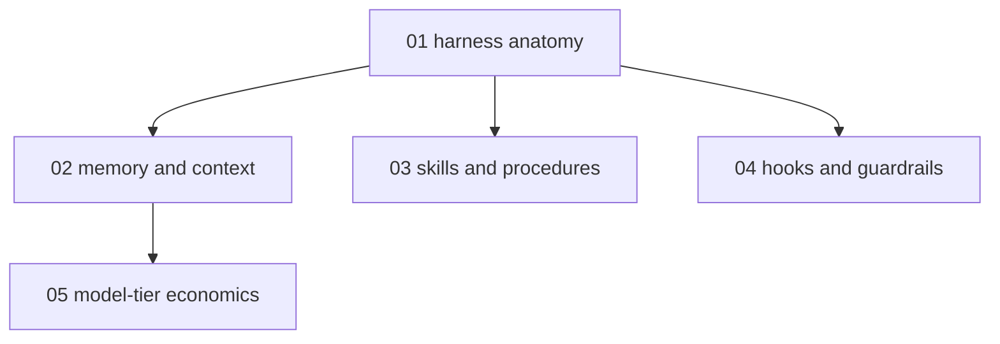

# Agent harness craft - map

**Audience:** developers who already use an agentic coding tool daily but drive it on
defaults - want to shape its instructions, context, guardrails, and cost deliberately.
**Estimated time:** 20-24 hours across 5 modules, understand-to-create depth (anatomy
first, then hands-on discipline, capture, guardrails, and economics).

<!-- meno:derived:start -->

**01 harness anatomy** (planned)
**02 memory and context** (planned)
**03 skills and procedures** (planned)
**04 hooks and guardrails** (planned)
**05 model-tier economics** (planned)
<!-- meno:derived:end -->

## My notes
(human territory; never regenerated)
