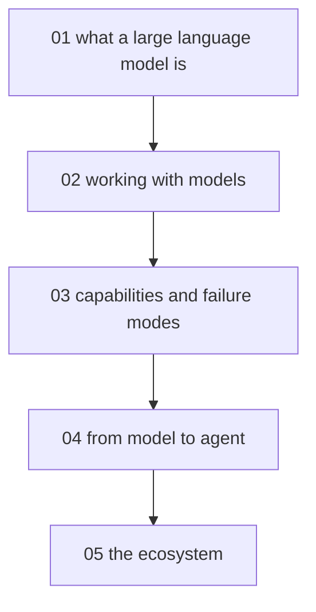

# Intro to AI and agents - map

**Audience:** developers fluent on the command line who are new to AI - comfortable with
git, scripting, and APIs (application programming interfaces), but with no machine
learning background. **Estimated time:**
14-16 hours across 5 modules, first-principles depth (understand the mechanism, then
apply it).

<!-- meno:derived:start -->

**01 what a large language model is** (planned)
**02 working with models** (planned)
**03 capabilities and failure modes** (planned)
**04 from model to agent** (planned)
**05 the ecosystem** (planned)
<!-- meno:derived:end -->

## My notes
(human territory; never regenerated)
