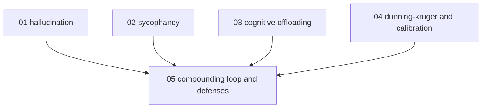

# Limits of agent-generated content - map

**Audience:** anyone who uses AI assistants to draft learning material or other
deliverables and wants to know where that goes wrong; no machine-learning background
needed. **Estimated time:** 14-16 hours across 5 modules, understanding-to-evaluation
depth (read the evidence, then apply it to your own workflow).

Modules 1-4 each cover one failure mode and are independent of one another; module 5
depends on all four, because its subject is how they compound.

<!-- meno:derived:start -->

**01 hallucination - mechanisms and taxonomies** (planned)
**02 sycophancy - telling you what you want to hear** (planned)
**03 the cost of offloading thinking** (planned)
**04 dunning-kruger and calibration** (planned)
**05 the compounding loop and its defenses** (planned)
<!-- meno:derived:end -->

## My notes
(human territory; never regenerated)
