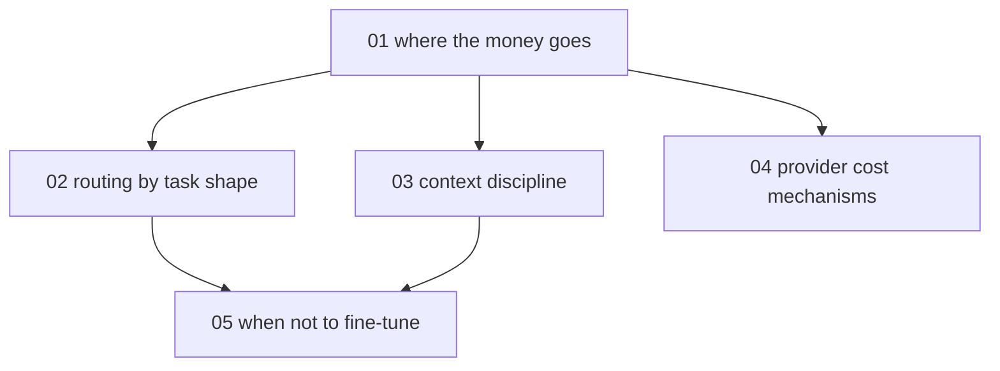

# LLM cost and token engineering - map

**Audience:** developers already shipping large language model (LLM) calls who watch
the bill climb without a clear picture of why; comfortable calling an API
(application programming interface), no machine-learning background needed.
**Estimated time:** 15-17 hours across 5 modules, from understanding the billing
model to evaluating a real fine-tuning decision.

Module 1 (measure first) grounds the rest. Modules 2-4 are the three independent
levers - routing, context discipline, provider mechanisms - and each needs only
module 1. Module 5 needs the routing and context modules, because the fine-tune
decision is argued against the baseline those two build.

Neighbor pack: [agent-harness-craft](../agent-harness-craft/agent-harness-craft-hub.md)
covers model-tier discipline as harness craft (subagent overrides, session usage
tooling); this pack covers the economics underneath.

<!-- meno:derived:start -->

**01 where the money goes** (planned)
**02 routing by task shape** (planned)
**03 context discipline as a cost lever** (planned)
**04 provider cost mechanisms** (planned)
**05 when not to fine-tune** (planned)
<!-- meno:derived:end -->

## My notes
(human territory; never regenerated)
