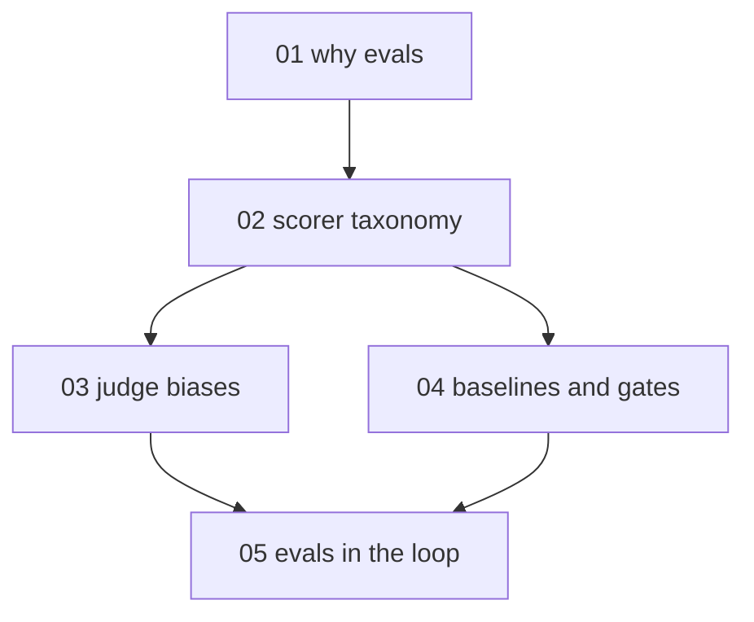

# LLM evals and judges - map

**Audience:** developers who ship features backed by a large language model (LLM) and
currently judge quality by eyeballing outputs; comfortable with code and tests, no
evaluation background needed. **Estimated time:** 14-16 hours across 5 modules,
building from understanding to applied gating (assemble a labelled set, pick scorers,
audit a judge, wire a gate, then run a real upgrade decision through it).

Module 1 motivates the whole discipline; module 2 builds the scorer vocabulary the
rest depends on; module 3 (judge biases) and module 4 (baselines and gates) each
build on module 2 independently; module 5 needs both, because iterating against a
suite only works once the scorers are trustworthy and the gate is wired.

Neighbors, not restated here: capability and failure-mode basics live in the
[intro-to-ai-and-agents](../intro-to-ai-and-agents/intro-to-ai-and-agents-hub.md)
pack; retrieval-grounding metrics live in the rag-grounding-and-faithfulness pack;
cost-aware model routing lives in the llm-cost pack.

<!-- meno:derived:start -->

**01 why evals - vibes do not regression-test** (planned)
**02 the scorer taxonomy** (planned)
**03 judge biases and how to contain them** (planned)
**04 baselines, guard bands, and gates** (planned)
**05 evals in the loop** (planned)
<!-- meno:derived:end -->

## My notes
(human territory; never regenerated)
