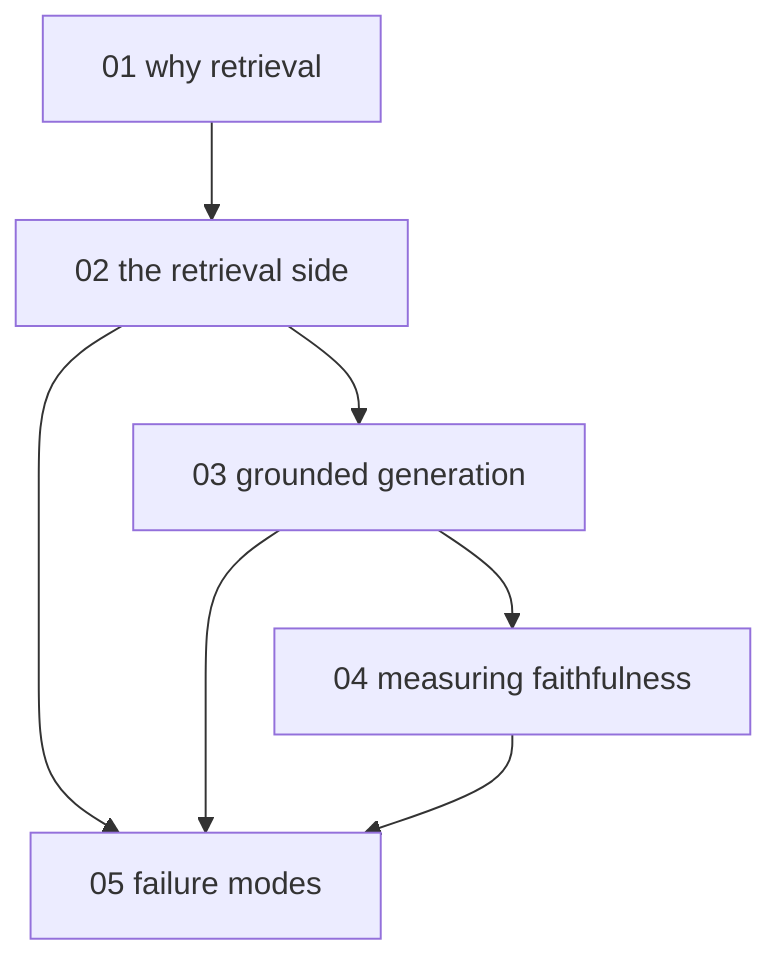

# RAG grounding and faithfulness - map

**Audience:** developers who can call a model API (application programming interface)
and want to build a RAG (retrieval-augmented generation) system whose answers they can
prove are grounded; no information-retrieval background assumed. **Estimated time:**
15-17 hours across 5 modules, from the case for retrieval through a built pipeline to
measurement and diagnosis.

Module 1 motivates the architecture; modules 2 and 3 build the retrieval and generation
halves in order; module 4 measures what was built; module 5 diagnoses how it fails and
depends on everything before it.

For hallucination and sycophancy as phenomena - why models produce plausible falsehoods
at all - see the sibling pack
[limits-of-agent-generated-content](../limits-of-agent-generated-content/limits-of-agent-generated-content-hub.md);
this pack teaches the engineering response.

<!-- meno:derived:start -->

**01 why retrieval - the limits of parametric knowledge** (planned)
**02 the retrieval side - chunking, embeddings, hybrid search, reranking** (planned)
**03 the generation side - grounding, citations, abstention** (planned)
**04 measuring faithfulness** (planned)
**05 failure modes of grounded systems** (planned)
<!-- meno:derived:end -->

## My notes
(human territory; never regenerated)
