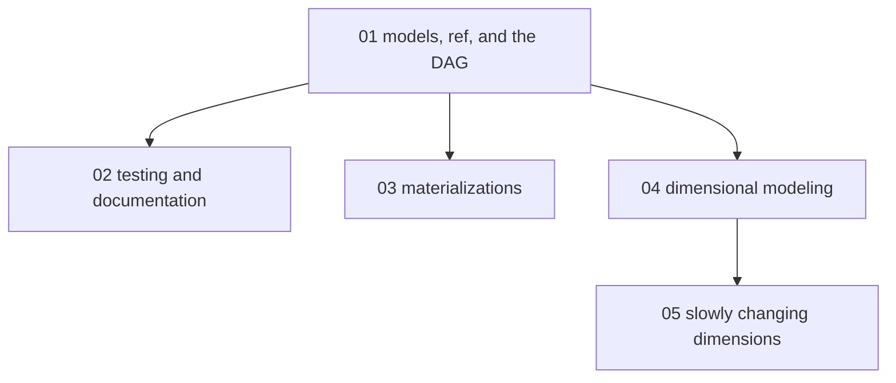

# Analytics engineering with dbt - map

**Audience:** developers comfortable with SQL and version control who are new to
analytics engineering - they can query a warehouse but have not owned a transformation
layer. **Estimated time:** 16-18 hours across 5 modules, from understanding the dbt
(data build tool) mental model to designing and historizing a star schema.

Module 1 is the foundation everything else references. Modules 2 and 3 branch off it
independently (trust, then cost). Module 4 introduces dimensional modeling and is the
only prerequisite for module 5, which adds history to the dimensions module 4 designs.
Grain appears in module 4 as a modeling decision only - what one fact row represents;
join execution mechanics are a different subject and are not taught here.

<!-- meno:derived:start -->

**01 models, ref(), and the DAG** (planned)
**02 testing and documenting models** (planned)
**03 materializations - how models persist** (planned)
**04 dimensional modeling - facts, dimensions, grain** (planned)
**05 slowly changing dimensions and snapshots** (planned)
<!-- meno:derived:end -->

## My notes
(human territory; never regenerated)
