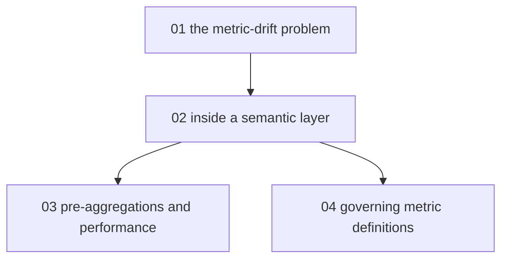

# Semantic layers and metric governance - map

**Audience:** analysts and analytics engineers who ship dashboards from already-modeled
warehouse tables and keep getting asked why two reports disagree; comfortable with SQL
(Structured Query Language), no semantic-layer experience assumed. **Estimated time:**
13-15 hours across 4 modules, from analyzing the drift problem to evaluating a
governance process.

Module 1 motivates everything: metric drift is the disease a semantic layer treats.
Module 2 is the core anatomy and gates both of the remaining modules - performance
(module 3) and governance (module 4) each build directly on it.

<!-- meno:derived:start -->

**01 the metric-drift problem - one label, three numbers** (planned)
**02 inside a semantic layer - measures, dimensions, entities** (planned)
**03 pre-aggregations and performance** (planned)
**04 governing metric definitions** (planned)
<!-- meno:derived:end -->

## My notes
(human territory; never regenerated)
