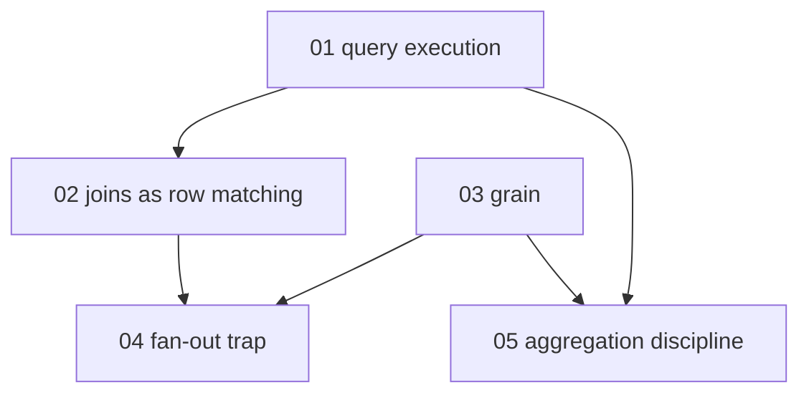

# SQL joins and grain - map

**Audience:** developers who can write basic SELECTs against one table and want to
combine tables without producing silently wrong numbers; no data-warehouse background
needed. **Estimated time:** 13-15 hours across 5 modules, building from execution-order
mechanics to grain-aware aggregation judgment.

Module 1 (execution order) underpins everything. Module 2 (joins) builds on it;
module 3 (grain) is independent and can be read in parallel. Module 4 (the fan-out
trap) needs both joins and grain, because fan-out is a grain violation committed
through a join. Module 5 (aggregation discipline) draws on execution order and grain.

<!-- meno:derived:start -->

**01 how a query actually runs** (planned)
**02 joins as row matching** (planned)
**03 grain - what one row means** (planned)
**04 the fan-out trap** (planned)
**05 aggregation discipline** (planned)
<!-- meno:derived:end -->

## My notes
(human territory; never regenerated)
