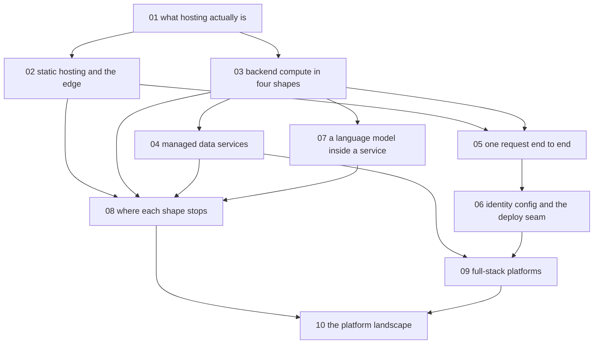

# Hosting and deployment - map

**Audience:** developers who build applications that run on localhost and now need to
choose and defend where those applications should actually run. No hands-on operations -
this course is deliberately about judgement, at an `analyze` ceiling. **Estimated time:**
40 hours across 10 modules.

**The four questions the course answers:** what this subject is collectively called, where
each hosting shape is used, how the shapes link into one working user experience, and where
each one stops - plus the standard way to bridge that gap. A platform survey runs alongside,
and every platform claim carries a dated citation, because published limits and pricing go
stale within months.

<!-- meno:derived:start -->

**01 what hosting actually is** (planned, 4h)
**02 static hosting and the edge** (planned, 4h)
**03 backend compute, in four shapes** (planned, 5h)
**04 managed data services** (planned, 4h)
**05 one request, end to end** (planned, 4h)
**06 identity, configuration, and the deploy seam** (planned, 3h)
**07 putting a language model inside a service** (planned, 5h)
**08 where each shape stops, and the standard bridges** (planned, 4h)
**09 full-stack platforms: what they bundle and what they hide** (planned, 3h)
**10 the platform landscape, and how to read it yourself** (planned, 4h)
<!-- meno:derived:end -->

## My notes
(human territory; never regenerated)
