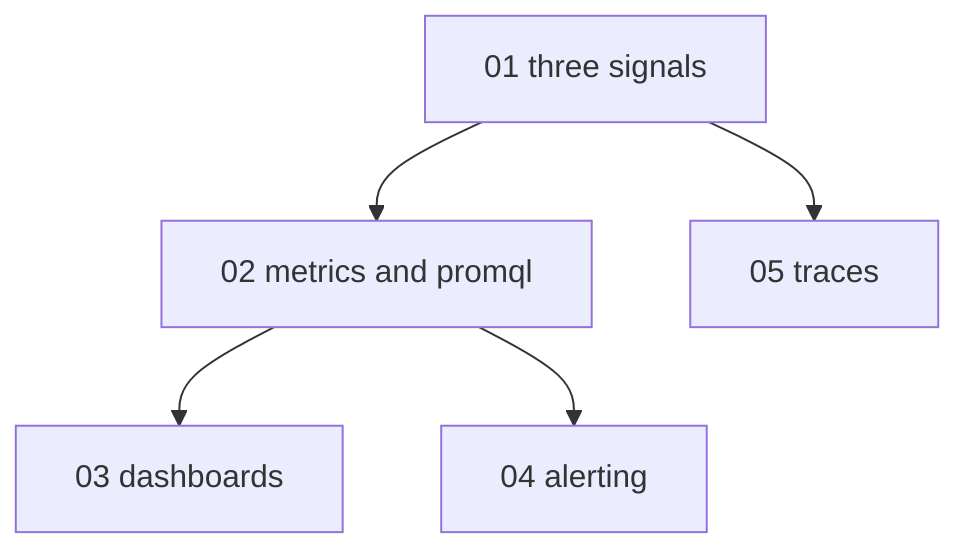

# Observability foundations - map

**Audience:** developers who run a service in production but have never set up
monitoring deliberately; comfortable in a shell and with YAML, no observability
background assumed. **Estimated time:** 16-18 hours across 5 modules, from signal
definitions up to designing dashboards and evaluating alert rules.

Module 1 frames metrics, logs, and traces as three lenses on the same system and is
the base for everything else. Modules 2-4 build the metrics path in order: types and
queries, then dashboards, then alerts. Module 5 (traces) needs only module 1 and can
be studied any time after it.

<!-- meno:derived:start -->

**01 the three signals - metrics, logs, and traces** (planned)
**02 metrics and query languages** (planned)
**03 dashboards that answer questions** (planned)
**04 alerting without the fatigue** (planned)
**05 traces and context propagation** (planned)
<!-- meno:derived:end -->

## My notes
(human territory; never regenerated)
