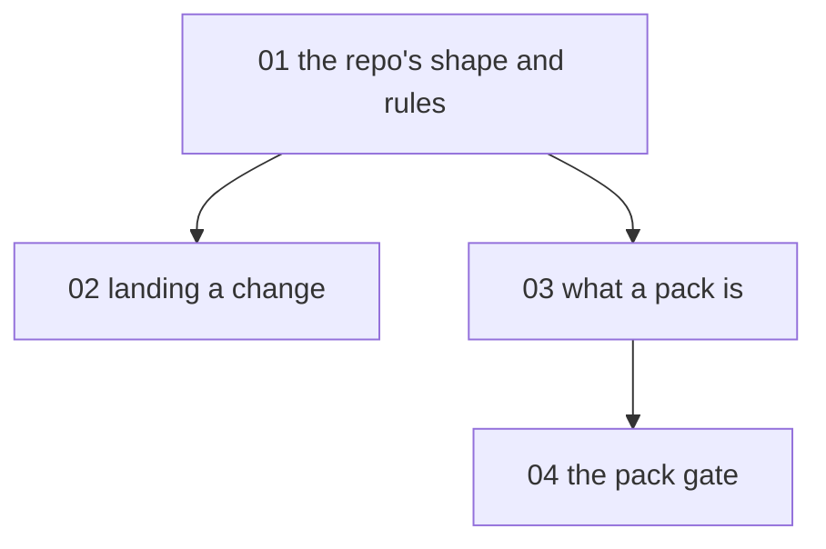

# Contributing to Meno - map

**Audience:** developers who want to contribute to Meno itself - comfortable with git
and a shell, new to this repository. **Estimated time:** 9-11 hours across 4 modules in
two streams: building Meno (modules 01-02) and authoring community content (modules
03-04). Exercise-driven throughout - every module ends in something real: a traced
convention, an opened pull request, a drafted pack, a green gate.

<!-- meno:derived:start -->

**01 the repo's shape and rules** (planned)
**02 landing a change** (planned)
**03 what a pack is** (planned)
**04 the pack gate** (planned)
<!-- meno:derived:end -->

## My notes
(human territory; never regenerated)
