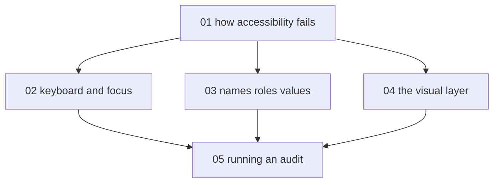

# Web accessibility audits - map

**Audience:** developers and designers who ship web interfaces and want to audit them
against WCAG (Web Content Accessibility Guidelines) 2.2 AA and fix what they find;
comfortable with HTML and CSS, no prior accessibility work assumed. **Estimated time:**
16-18 hours across 5 modules, understanding-to-evaluation depth (learn the criteria,
apply them to real pages, then run and write up a full audit).

Module 1 grounds everything and gates the rest. Modules 2-4 are the three audit
surfaces and are independent of one another; module 5 depends on all three, because
an audit exercises every surface at once.

<!-- meno:derived:start -->

**01 how accessibility fails and who it fails** (planned)
**02 keyboard and focus** (planned)
**03 names, roles, and values** (planned)
**04 the visual layer** (planned)
**05 running an audit** (planned)
<!-- meno:derived:end -->

## My notes
(human territory; never regenerated)
