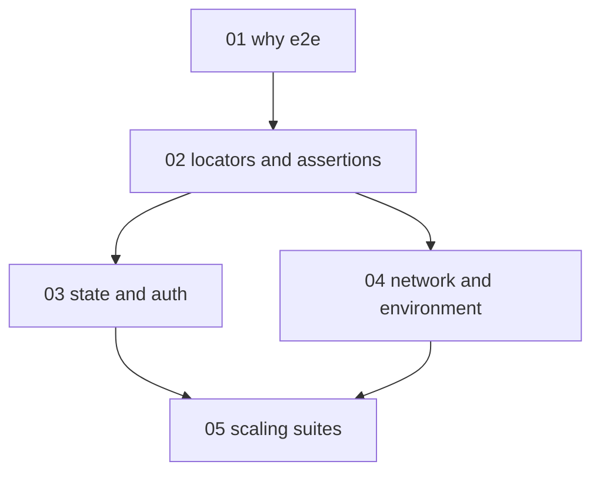

# Browser end-to-end testing with Playwright - map

**Audience:** developers who write unit tests but no end-to-end (E2E) tests; comfortable
with JavaScript or TypeScript and a terminal. **Estimated time:** 18-22 hours across
5 modules, strategy first, then hands-on browser-test craft, then suite-scale concerns.

Module 1 stands alone (strategy). Module 2 is the craft core everything else builds on:
modules 3 and 4 each extend it independently, and module 5 assumes both, because scaling
a suite only matters once its tests are isolated and deterministic.

The pull request and code review flow around a continuous integration (CI) run is owned
by the software-engineering/git-fundamentals pack; module 5 covers only the
Playwright-specific mechanics of that run.

<!-- meno:derived:start -->

**01 why end-to-end tests, and where they sit** (planned)
**02 locators and assertions that wait** (planned)
**03 state, authentication, and isolation** (planned)
**04 controlling the network and the clock** (planned)
**05 scaling and debugging the suite** (planned)
<!-- meno:derived:end -->

## My notes
(human territory; never regenerated)
