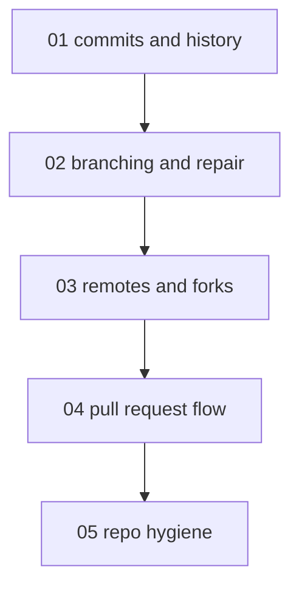

# Git fundamentals - map

**Audience:** developers who already use git daily but shallowly - comfortable in a
shell, know `add`/`commit`/`push`/`pull`, want working fluency past that. **Estimated
time:** 20-24 hours across 5 modules, build depth (hands-on, apply-level).

<!-- meno:derived:start -->

**01 commits and history** (planned)
**02 branching and repair** (planned)
**03 remotes, clones, and forks** (planned)
**04 the pull request flow** (planned)
**05 repository hygiene** (planned)
<!-- meno:derived:end -->

## My notes
(human territory; never regenerated)
