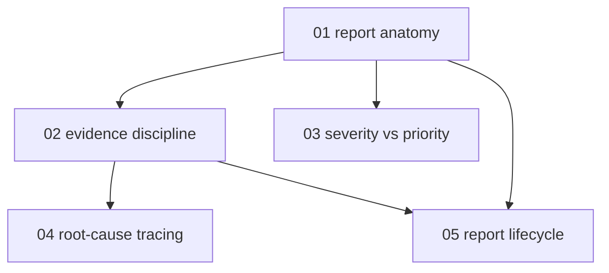

# Evidence-based bug reporting - map

**Audience:** anyone who files defects for someone else to fix - testers, developers,
support staff, or users of any software project; no formal quality-assurance background
needed. **Estimated time:** 14-16 hours across 5 modules, apply-to-evaluate depth (learn
the anatomy, then use it on real failures and judge the hard calls).

Module 1 is the foundation everything else refines. Module 2 sharpens what counts as
evidence inside a report; modules 3 and 5 both build directly on the report anatomy;
module 4 additionally leans on evidence discipline, because tracing a symptom is
evidence-gathering under a stop rule.

<!-- meno:derived:start -->

**01 anatomy of a reproducible report** (planned)
**02 evidence discipline - observation, hypothesis, confidence** (planned)
**03 severity versus priority** (planned)
**04 root-cause tracing - from symptom to failing layer** (planned)
**05 the report's lifecycle - retests, corrections, closure** (planned)
<!-- meno:derived:end -->

## My notes
(human territory; never regenerated)
