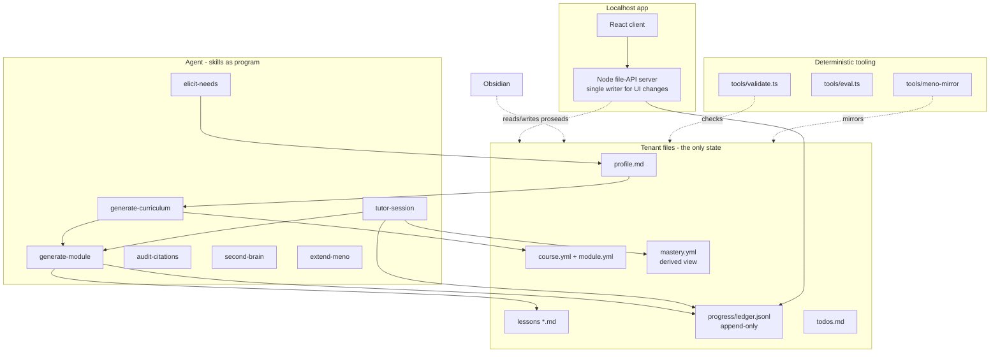

# Meno architecture

*The system as designed: what the pieces are, how data flows between them, and the seams that
must not blur. Behavior details live in the per-subsystem specs under [specs/](specs/); why
these choices were made lives in [RESEARCH.md](RESEARCH.md); build order and acceptance
criteria live in [PLAN.md](../PLAN.md).*

## Three pillars

Meno is one repository serving three surfaces over the same files:

- **Obsidian, the second brain.** Each tenant's `content/<tenant>/` directory is itself an
  Obsidian vault: every lesson, hub note, and concept is connected markdown with wikilinks.
  Obsidian is the reflective view - the graph of what you know.
- **The localhost app, the study surface.** A local web app (Vite + React client, small Node
  file-API server) renders courses, runs recognition checks, tracks progress, and manages
  todos. It reads and writes the same files; there is no database.
- **The agent, the author and tutor.** An agent CLI running the skills in `.agents/skills/`
  interviews, generates, and tutors. The skills are the program; the agent is the runtime.
  Meno ships almost no model-calling code.

## Component map



Data flows one way through generation (interview to profile to skeleton to lessons) and
accumulates in the ledger from two writers; everything else is a derived view.

## The write-authority seam

The central correctness boundary in Meno (decision 14). Two writers touch tenant state, with
disjoint authority:

| Writer | May write | May never write |
|---|---|---|
| App server (on the UI's behalf) | todos, reading progress, recognition-level check results (`source: ui`, `level: recognition`) | any agent-typed event, any transfer-level result, any gate event, `mastery.yml` |
| Agent (skills, direct file access) | everything an author and tutor needs: content, manifests, hub notes, agent-typed ledger events, `mastery.yml` | nothing structurally, but skills follow the same formats validate enforces |

Enforcement is by construction, not by validation: the server exposes no endpoint that
accepts `event`, `source`, or `level` from a client - those literals are hardcoded
server-side at the only two call sites that append. Mastery gates key exclusively on
`source: agent` plus `level: transfer` events, so no sequence of UI actions can unlock a
module. The full event vocabulary and derivation rules live in
[specs/progress.md](specs/progress.md) (lands Phase 3).

## Cross-cutting build decisions

Decided at build start (2026-08-05) by a design council; these hold everywhere:

- **One runtime: Node.** The app makes Node unavoidable, so `tools/` is TypeScript too
  (`tools/validate.ts`, `tools/eval.ts`), superseding the plan's provisional `.py` naming.
  The decisive reason is single implementation: mastery derivation, check parsing, wikilink
  resolution, and YAML parsing each exist exactly once, imported by app, validate, and eval
  alike. Two implementations of a function whose defining property is determinism is how
  silent divergence ships.
- **Zero build step for the server and tools.** Node 26 runs TypeScript directly via type
  stripping; `tsconfig` sets `erasableSyntaxOnly` so violations fail at typecheck, not at
  runtime. Only the React client has a build (Vite).
- **The exception: `tools/meno-mirror` is POSIX shell.** It must work when `node_modules` is
  absent or the app is broken - that is precisely the disaster it exists for - and 150 lines
  of shell is auditable line-by-line before a user trusts it with private data.
- **Files are truth; caches are hints.** The server walks the tenant tree on request with an
  mtime cache. Correctness never depends on a file watcher.
- **Specs are per-subsystem, not per-phase.** Phases are a schedule; subsystems are the
  thing. Each phase lands or amends the spec files for the subsystems it touches (table
  below).

## Repository layout

```
AGENTS.md                    canonical agent entry point (CLAUDE.md is a one-line shim)
.agents/skills/              the program: elicit-needs, generate-curriculum, generate-module,
                             tutor-session, audit-citations, second-brain, extend-meno
.claude/skills/              symlinks into .agents/skills/
docs/                        this file, specs/, RESEARCH.md, guides, migrations.md
schemas/                     JSON Schema files - the machine-checkable format contracts
examples/example-learner/    committed fake-persona tenant: living spec + test fixture
app/                         localhost app: server/ (Node, no build) + client/ (Vite + React)
tools/                       validate.ts, eval.ts, meno-mirror
topic-packs/                 pre-vetted shareable curricula (same schema as courses)
content/<tenant>/            gitignored; a real learner's Obsidian vault
```

## Phase-to-spec table

Every phase ships behavior and the spec that describes it. A phase is not done while its
spec row is stale.

| Spec | Subsystem | Lands | Amended by |
|---|---|---|---|
| [specs/repo-and-tenancy.md](specs/repo-and-tenancy.md) | layout, entry points, tenancy boundary | Phase 0 | 7 |
| [specs/interview.md](specs/interview.md) | elicit-needs, profile lifecycle | Phase 1 | 5 |
| [specs/curriculum.md](specs/curriculum.md) | skeleton generation, sourcing, manifests | Phase 2 | 3 |
| [specs/validation.md](specs/validation.md) | validate checks, exit codes, policy | Phase 2 | 3, 4, 5, 8 |
| [specs/lessons.md](specs/lessons.md) | lesson generation, anatomy, checks | Phase 3 | 6 |
| [specs/progress.md](specs/progress.md) | ledger events, mastery derivation, gates | Phase 3 | 5 |
| [specs/app.md](specs/app.md) | server + client, API surface, write path | Phase 4 | - |
| [specs/tutor-session.md](specs/tutor-session.md) | review sessions, grading, generate-ahead | Phase 5 | - |
| [specs/citations.md](specs/citations.md) | audit protocol, stale-content flows | Phase 6 | - |
| [specs/durability.md](specs/durability.md) | init, private mirror, restore | Phase 7 | - |
| [specs/quality.md](specs/quality.md) | evals, baselines, smoke protocol, topic packs | Phase 8 | - |

Vault conventions (wikilinks, hub notes, todos) deliberately have no spec file: the
`second-brain` skill and its references are the canonical owner, and a spec would duplicate
them. The app spec describes only how the app consumes those conventions.
