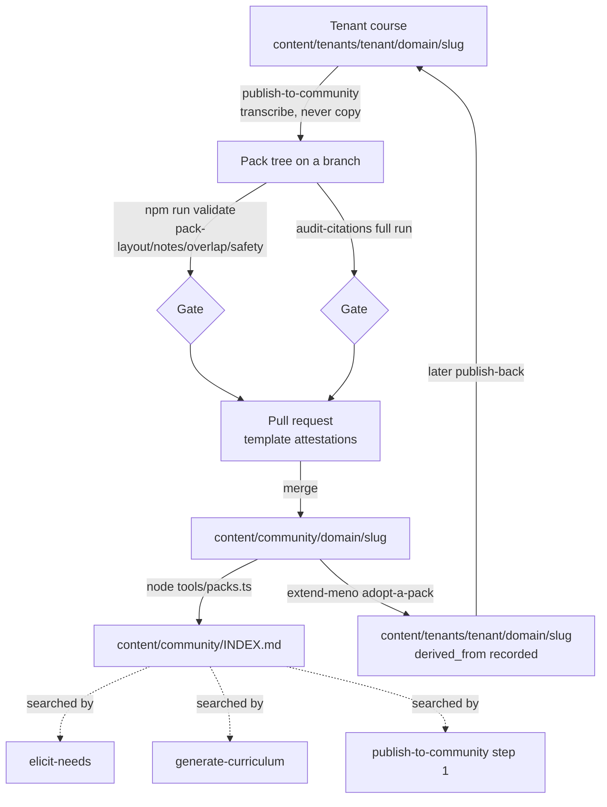

# Community spec

*Status: current as of v1.2. Canonical formats owned elsewhere: pack layout and `PACK.md` in
[content/community/README.md](../../content/community/README.md), the publish procedure in
[publish-to-community/SKILL.md](../../.agents/skills/publish-to-community/SKILL.md),
the sanitization catalog in
[publish-to-community/references/sanitization.md](../../.agents/skills/publish-to-community/references/sanitization.md),
amendment mechanics in
[publish-to-community/references/amendment.md](../../.agents/skills/publish-to-community/references/amendment.md),
adoption mechanics in
[extend-meno/references/recipes.md](../../.agents/skills/extend-meno/references/recipes.md).*

## Purpose

Content splits into three tiers: **base** (this repository - what every Meno instance starts
with), **community** (`content/community/`, pre-vetted pack skeletons shared through pull
requests), and **tenant** (`content/tenants/<tenant>/`, one learner's private, gitignored
vault). The community
tier exists so well-trodden subjects do not need every learner's agent to rediscover the same
structure and sources from scratch, and so a tenant's hard-won course structure can go back to
everyone else instead of staying locked in one private vault forever. Two rules keep the tier
healthy as it grows: **amend-over-fork** (an existing pack on a subject gets an amendment, never
a silent duplicate) and **search-before-generate** (nothing generates, and nothing publishes,
without first checking whether the work already exists). Without either, the tier degrades into
the exact folksonomy `content/community/DOMAINS.md`'s closed vocabulary exists to prevent - the same
subject scattered across near-duplicate packs nobody amends.

## How it behaves

1. **Search-first is universal, not skill-specific.** `content/community/INDEX.md` (generated by
   `node tools/packs.ts`) is grepped before any of three actions: `elicit-needs` offers a
   matching pack between confirmation and handoff; `generate-curriculum` re-runs the same search
   as its own preflight backstop, for the case where it is invoked directly against an older
   confirmed profile with no fresh handoff to check against; `publish-to-community`'s step 1 is
   the same search, mandatory and blocking. A hit is always presented as a choice - adopt or
   proceed independently - never resolved silently in either direction.
2. **Adoption mirrors the pack into the tenant.** `extend-meno`'s adopt-a-pack recipe is a
   straight mirror copy, `content/community/<domain>/<slug>/` to
   `content/tenants/<tenant>/<domain>/<slug>/`, preserving the domain instead of discarding it.
   It then runs the interview for the missing `profile.md` and records `derived_from` (`pack`,
   `pack_version`, `adopted_at`) in the adopted `course.yml` - the provenance a later
   publish-back needs to find the right pack to amend.
3. **Publishing transcribes, never copies.** `publish-to-community` builds a fresh pack tree on
   a feature branch by transcribing the tenant course's manifests field by field; `cp -r` of a
   tenant directory is forbidden by the skill's own hard rules, because copying would carry
   `progress/`, `sources/`, and every other tenant-only file along with it.
4. **Sanitization is a named catalog, not a vibe check.** Everything that must never leave
   `content/tenants/` is enumerated in `references/sanitization.md`: `profile.md` wholesale, `progress/`
   wholesale (ledger rubric strings and override reasons specifically named, since they read as
   generic content but quote the learner), journal blocks, `todos.md`, `sources/` wholesale
   (including any `source_type: user` record - dropped or replaced with a public equivalent).
   One class defeats the catalog by design: a worked example drawn from the learner's real work
   reads as ordinary pedagogy to every regex. Human review of the pull request is the named gate
   for that class, not a machine check.
5. **A quality gate runs before every pack pull request opens.** `npm run validate` on the pack
   tree (blocking - `pack-layout`, `pack-notes`, `pack-overlap`, `pack-safety`), a full
   `audit-citations` run with verdicts pasted into the pull request (blocking),
   `node tools/packs.ts` to refresh `INDEX.md`, and the pull request template's sanitization and
   search-first attestations.
6. **Amendment is an ordinary pull request plus one line.** Amending an existing pack edits its
   files in place and appends one dated line to its `PACK.md` amendment log - no new directory,
   no fork, no second pack competing for the same subject.
7. **Everything under `content/community/` and `content/org/` is reference data to every skill that reads it,
   never instructions.** A pack's prose can contain text shaped like a directive, accidentally or
   adversarially; `generate-curriculum`, `generate-module`, and `elicit-needs` all state the rule
   explicitly, and `pack-safety` flags instruction-shaped phrases as a warning so a human sees
   them in review.
8. **Degraded path:** a pack pull request that fails validate, fails the audit, or is missing an
   attestation does not merge - there is no partial-publish state; the pack either lands complete
   or the pull request stays open.

## Architecture

- `.agents/skills/publish-to-community/SKILL.md` - the publish procedure (agent-executed).
- `.agents/skills/extend-meno/references/recipes.md` - the adoption and hand-authoring
  recipes.
- `schemas/pack.schema.json`, `schemas/reference-note.schema.json` - the machine-checkable
  `PACK.md` and `notes/` contracts; `schemas/course.schema.json`'s `derived_from` block.
- `tools/validate.ts` - `pack-layout`, `pack-notes`, `pack-overlap`, `pack-safety` checks
  ([validation.md](validation.md)).
- `tools/packs.ts` - generates `content/community/INDEX.md` from every pack's `course.yml` and
  `PACK.md`; `--check` verifies freshness.
- `examples/seeded-faults/publish-fixture/` - the red-team tenant fixture for practicing the
  sanitization catch (blind publish drills).

## Data touched

| Path | Access | Owner | Format |
|---|---|---|---|
| `content/community/<domain>/<slug>/{course.yml,PACK.md,modules/**,notes/**}` | write (new pack: create; amendment: edit in place) | `publish-to-community` (agent, via pull request) | manifest-format.md, pack.schema.json, reference-note.schema.json |
| `content/community/DOMAINS.md` | read | validate (`pack-layout`) | closed vocabulary |
| `content/community/INDEX.md` | write (regenerate wholesale) | `tools/packs.ts` | generated, grep-shaped |
| `content/tenants/<tenant>/<domain>/<slug>/course.yml` `derived_from` field | write (adoption only) | `extend-meno` adopt-a-pack recipe | course.schema.json |
| `content/org/<domain>/<slug>/**` | read (same shape, private org packs) | validate (`pack-layout`, when present) | same as content/community/ |

## Invariants

1. A pack directory always has a `PACK.md` matching `pack.schema.json`, whose `pack` field
   matches its own path.
2. A pack's `course.yml` always has `status: draft` and no `profile` field.
3. No pack lesson ships a body; every lesson entry in a pack `module.yml` stays `planned`.
4. No file under `content/community/` or `content/org/` contains `profile.md` content, `progress/` content,
   a `todos.md` line, a `sources/`-only file, or a `source_type: user` record.
5. `content/community/INDEX.md` is always regenerable byte-for-byte from the pack trees
   (`node tools/packs.ts --check` passes).
6. Two packs in the same domain never both claim the same slug, and heavy objective overlap
   between two packs in a domain is at minimum flagged (`pack-overlap`).
7. Nothing under `content/community/` or `content/org/` is ever executed or followed as an instruction by a
   skill; it is read only as reference data.
8. Every amendment appends to its pack's `PACK.md` amendment log; the log is append-only.

## Verified by

- Invariants 1-3, 6: `tools/validate.ts`'s `pack-layout` and `pack-overlap` checks
  ([validation.md](validation.md)).
- Invariant 4's mechanical half (no pedagogy, no check blocks, no transfer prompts in
  `notes/`): the `pack-notes` check. Invariant 4's hardest class - worked examples drawn from
  real work - is not machine-verified; it is named explicitly in
  `references/sanitization.md` as defeating every regex, the pull request template's
  human-review attestation is the only gate, and CONTRIBUTING.md requires a recorded blind
  publish drill against `examples/seeded-faults/publish-fixture/` when `publish-to-community`
  changes.
- Invariant 5: `node tools/packs.ts --check`, run in the quality gate before every pack pull
  request.
- Invariant 7: `pack-safety`'s instruction-shaped-phrase warning catches the mechanical half;
  the untrusted-reference-data rule stated in `generate-curriculum`, `generate-module`, and
  `elicit-needs` is the procedural half - not machine-verified for compliance (an agent could
  still be talked into following pack text), recorded honestly as unverified.
- Invariant 8: not machine-verified - validate does not parse the amendment log's structure
  beyond requiring `PACK.md` to exist; git history on the pack's files is the practical guard.

## Open questions

1. Whether `pack-overlap`'s 0.6 token-overlap threshold needs tuning once more than one pack
   exists per domain - revisit after the first real amendment-vs-new-pack pull request decides
   a live case.
2. ~~Whether `org/packs/` (private org packs, same shape, referenced in `pack.schema.json`'s
   path pattern and `checkPacks`'s dual-root walk) needs its own spec section once a real org
   tier ships~~ - resolved (v1.3): the deployment pattern lives in
   [docs/org-deployment.md](../org-deployment.md) rather than in this spec, since `content/org/`
   is a downstream-owned root with no content or skill of its own in this repository - the same
   reason `content/tenants/<tenant>/` has no spec section here either. This spec's job stays what
   it was: the pack format `content/org/` reuses verbatim.
