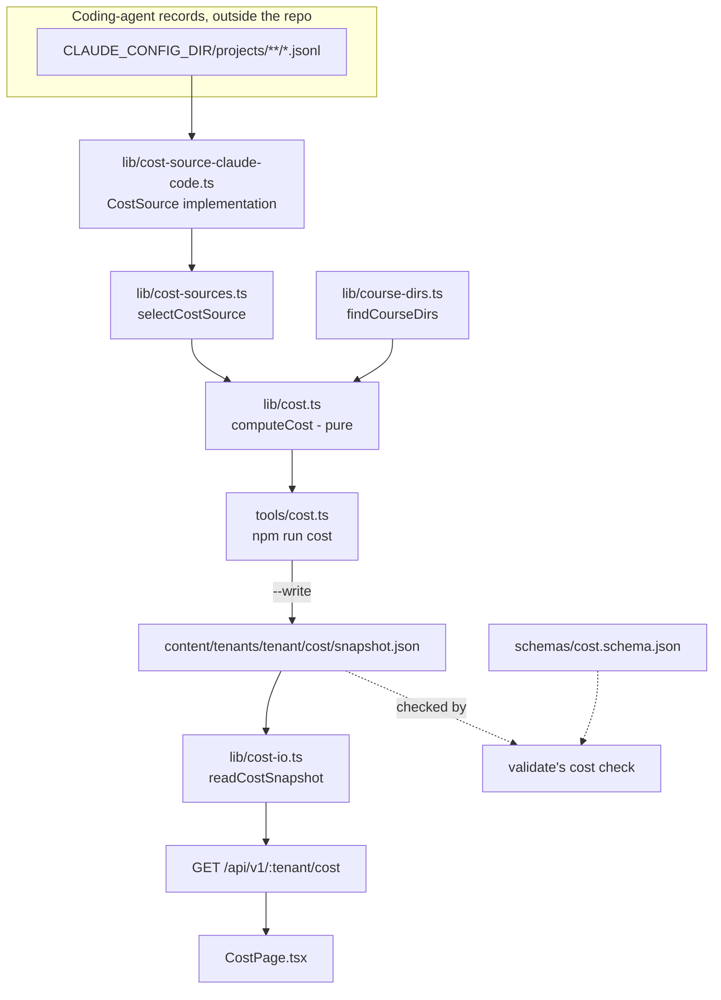

# Content-cost spec

*Status: contract written 2026-08-12, build not started. This spec owns the cost subsystem end to
end: the cost-source adapter contract, the pure aggregation, the snapshot format, the read-only
surface (endpoint, CLI, page), and the disclosures the page must carry. Canonical formats owned
elsewhere: course directory layout in [../../lib/course-dirs.ts](../../lib/course-dirs.ts) and
[manifest-format.md](../../.agents/skills/generate-curriculum/references/manifest-format.md);
tenancy and the leakage rule in [repo-and-tenancy.md](repo-and-tenancy.md); the read-only app
surface in [app.md](app.md). The machine contract for the snapshot file is
`schemas/cost.schema.json`.*

The subsystem is called **cost** everywhere: file names, type names, route, page, script.
`lib/insights.ts` already owns the word **usage**, where it means the authored-check usage rate.
The two must never be confused, and no cost identifier may be named `usage`.

## Purpose

A learner who generated seven courses with a coding agent has no way to see what that cost. The
question is not "what was I billed" - most learners are on a subscription and were billed nothing
extra - it is "which of these courses was expensive to make, relative to the others". Cost answers
exactly that: for each course in a tenant vault, the deduplicated token spend of the agent
transcripts that wrote it, priced at published per-token list rates, with an honest no-data state
for the courses no evidence covers.

Scope is the **tenant** only. Building Meno itself (`app/`, `tools/`, `docs/`, `schemas/`,
`evals/`, `examples/`) and authoring community packs (`content/community/`) are both out, because
contributing upstream is optional and most instances will never do it. That exclusion is not a
filter anyone has to maintain: attribution happens through written file paths under
`content/tenants/<tenant>/`, so work that never wrote there is simply never attributed.

## How it behaves

1. A **cost source** is an adapter. It knows how to read one coding agent's local records and emit
   per-transcript evidence. Claude Code is one implementation
   (`lib/cost-source-claude-code.ts`). An instance running on a command-line interface with no
   implementation gets an empty snapshot and an empty page, never a crash and never a zero.
2. Attribution is at **transcript** granularity, keyed by written file path. A transcript that
   wrote into exactly one course directory has its entire deduplicated cost credited to that
   course. Crediting only the single request that made the `Write` call was measured at 0.9 percent
   of spend and priced a real course at $0.15 against a whole-transcript figure of $11.50; the
   narrow reading is the wrong one.
3. There is **no workflow-stage breakdown**. A course row is one number. In every observed case one
   transcript wrote exactly one course, so a course total requires no inference at all, while
   splitting it into interview, curriculum, and module phases would reintroduce one.
4. A transcript that wrote into **two or more** course directories, and a transcript that wrote
   into none but is the structural **parent** of sub-agent transcripts that did, both go to a
   single visible **shared orchestration** line. That line is shown whole and is never divided
   pro rata between the courses it covers.
5. A course whose only evidence came from a transcript with such a parent is marked
   **generation-only** rather than **full**: the figure covers the sub-agent that wrote the course
   and excludes the interview and planning that ran in the parent session.
6. A course directory that exists on disk with no transcript evidence is reported as **no data**.
   It is never reported as $0. The no-data list comes from `lib/course-dirs.ts`, the one
   implementation of "where are this tenant's courses", never from a second walk.
7. Aggregation (`computeCost`, `lib/cost.ts`) is **pure**: no clock, no filesystem, no environment.
   `generated_at` is a parameter, mirroring the rule `lib/insights.ts` and `lib/mastery.ts` hold to.
8. `node tools/cost.ts <tenant-dir> [--json] [--write]` (`npm run cost --`) runs the scan and
   prints a readable summary or the raw snapshot JSON. `--write` additionally writes the snapshot
   to the tenant vault. This is the only writer.
9. `GET /api/v1/:tenant/cost` **reads the written snapshot**; it never scans. Scanning every
   transcript on a machine is seconds of I/O, and a page load must not pay it. There is no `POST`
   sibling: write authority (decision 14) is untouched by this subsystem.
10. Degraded paths, all of them non-errors: no snapshot file yet, a snapshot that does not parse, a
    snapshot written by a source that is no longer available, and a snapshot with no course rows.
    Each renders an empty state naming which case it is.

## Architecture



## The adapter contract

A cost source is a plain object satisfying `CostSource`. It is the only part of the subsystem that
knows about a specific coding agent, and the only part that touches anything outside the repository.

```ts
// lib/cost.ts - the contract every cost source implements.

/** USD per 1,000,000 tokens, one model tier. */
export interface TokenPrices {
  input: number;
  cache_write_1h: number;
  cache_write_5m: number;
  cache_read: number;
  output: number;
}

/**
 * A course directory a transcript wrote into. `dir` is the identity, not `course`: two courses
 * in different domains can share a basename, and only the full path disambiguates which one a
 * transcript actually wrote into (amended 2026-08-12, adversarial review finding 3 - the first
 * draft keyed attribution on the bare basename and could silently collapse or lose evidence for
 * two same-named courses).
 */
export interface CostCourseRef {
  tenant: string; // tenant directory name under content/tenants/
  course: string; // course directory basename, which is what a written path's last segment reveals
  dir: string; // vault-relative course directory, "<domain>/<course>" - the disambiguating identity
}

/** One transcript's evidence. The unit of attribution (decision 3). */
export interface CostTranscript {
  /** Stable, source-scoped identifier. Claude Code uses the path relative to projects/. */
  id: string;
  /**
   * The orchestrating transcript this one ran under, derived structurally by the source.
   * Non-null does not mean present: computeCost only honours a parent_id that names another
   * transcript in the same list.
   */
  parent_id: string | null;
  /** Deduplicated cost of every model request in this transcript, unrounded USD. */
  cost_usd: number;
  /** Deduplicated request count: the cardinality of the dedupe key. */
  requests: number;
  /** Course directories written into, deduplicated by (tenant, dir), sorted by tenant then dir. */
  wrote: CostCourseRef[];
}

/**
 * The result of one collect() call: the evidence found, plus what could not be read. Added
 * 2026-08-12 (adversarial review finding NEW-6): a source that swallows a read failure without
 * counting it makes a partial scan byte-indistinguishable from a complete one, silently
 * contradicting the "every figure is a floor" disclosure this whole subsystem makes.
 */
export interface CostCollectResult {
  transcripts: CostTranscript[];
  /**
   * Directories or individual transcripts the source could not read (a permissions error, a
   * broken symlink, a malformed file) and skipped rather than counted. computeCost surfaces a
   * nonzero count in `limits` so this is concrete, not merely asserted.
   */
  skipped: number;
}

export interface CostSource {
  /** Machine name recorded in the snapshot, kebab-case. */
  readonly name: string;
  /** Human label for the page, for example "Claude Code transcripts". */
  readonly label: string;
  /** Date the price table was last checked against published rates, YYYY-MM-DD. */
  readonly prices_as_of: string;
  /** True when this machine holds records this source can read. Must never throw. */
  available(): boolean;
  /**
   * Every transcript this source can read on this machine, across every tenant and project -
   * not only the ones with course-write evidence. computeCost, not collect(), is what narrows
   * this down to one tenant's attributed evidence (amended 2026-08-12, adversarial review finding
   * 4 - the original wording overclaimed that this list was already filtered to "evidence").
   * Must never throw; an empty result with skipped: 0 when unavailable.
   */
  collect(): CostCollectResult;
}
```

**Selection and degradation.** `lib/cost-sources.ts` holds the registry and the resolver:

```ts
// lib/cost-sources.ts
import type { CostSource } from './cost.ts';
export const COST_SOURCES: CostSource[] = [claudeCodeSource];
/** The first registered source reporting available(), or null. Never throws. */
export function selectCostSource(sources?: CostSource[]): CostSource | null;
```

Rules a source implementation must hold to, all of them load-bearing:

- `available()` and `collect()` never throw. A malformed record, an unreadable directory, a
  permissions error, or a record format the source does not recognise is skipped, not raised. The
  registry wraps every call in a try/catch as a second line of defence and treats a throw as
  unavailable, but a source that relies on that wrapper is a broken source.
- `collect()` returns `transcripts` in a deterministic order (sort by `id`), and counts every skip
  into `skipped` rather than swallowing it - a directory that could not be listed, an entry whose
  type could not be determined, a transcript file that could not be read or parsed. `skipped`
  need not distinguish these cases from each other; it exists so a partial scan is visibly partial.
  `skipped` counts **skip events, not transcripts**: an unreadable directory is one event no
  matter how many transcript files it held, because that count is unknowable - the directory
  cannot be listed to produce it (amended 2026-08-12, adversarial review finding NEW-6-followup;
  the emitted `limits` line says "location(s)", never "transcript(s)", for the same reason).
- A source never reads a course's content, never reads a transcript's message text into the
  snapshot, and never writes anything.
- Registration order is precedence order. There is one entry today, and a second entry must not
  reorder the first.
- **`parent_id` must never cycle.** `computeCost`'s demotion resolver (`resolveDemoted` in
  `lib/cost.ts`) walks the `parent_id` chain and guards against a cycle defensively, but that guard
  is not a correctness feature: with a cycle, whichever node the resolver happens to visit first
  resolves as credited, an artifact of traversal order rather than of the data, which would break
  invariant 1's byte-identical-JSON guarantee for that input (money still conserves; only which
  course gets the credit becomes order-dependent). The Claude Code adapter can never emit a cycle -
  `parentIdOf` always yields a `parent_id` strictly shorter than the transcript's own id, so the
  chain strictly shortens toward `null` - and every future source must hold to the same property
  (added 2026-08-12, adversarial review finding NEW-6-followup / item 6: documented as a constraint
  rather than coded as a check, since it is unreachable from any source that respects it).

**The Claude Code implementation** lives at `lib/cost-source-claude-code.ts`, name
`"claude-code"`, and is specified in full below under "The Claude Code source".

## Types

The producer types live in `lib/cost.ts`; the wire type lives in `app/shared/types.ts` and
re-exports rather than duplicates, exactly as `InsightsReport` does. Read the shapes there - this
spec owns behavior, and a second copy of an interface here would only drift from the one the
compiler checks.

Two shape decisions worth stating where they are not obvious from the code. `CourseCost.course` is
keyed by directory rather than by the `course.yml` slug, because a written file path reveals the
directory and the two can differ for a hand-made course. `CourseCost.cost_usd` floors to $0.01 when
the unrounded cost is above zero but rounds below a cent (amended 2026-08-12, adversarial review
finding 2), so a course with real evidence never renders as $0.00 - plain rounding both
misrepresented the course and violated the schema's own `exclusiveMinimum` on that field.

## `schemas/cost.schema.json`

The shape lives in `schemas/cost.schema.json`; the reasoning lives here. Same draft and `$id`
convention as `schemas/insights.schema.json`, with one deliberate difference: `additionalProperties`
is `false` throughout. `insights.schema.json` describes frontmatter a human and a skill write, so it
is permissive; this describes a file our own tool produces, where the schema is the contract and an
unexpected key means the producer drifted. Adding a field is therefore a schema edit in the same
change, which is the point.

The `cost` check in `tools/validate.ts` follows the `checkInsights` shape exactly: load the schema
with `loadSchema('cost.schema.json')`, select files with `/\/cost\/snapshot\.json$/`, push one
error finding per Ajv error under `check: 'cost'`, then add three cross-field checks the schema
cannot express:

- `totals.attributed_usd` differs from the sum of the rounded `courses[].cost_usd` by more than
  half a cent (error).
- A `dir` appears in both `courses[].dir` and `no_data[].dir` (error). Compared by `dir`, never by
  `course` (amended 2026-08-12, adversarial review finding NEW-1): two directories in different
  domains can legitimately share a basename, one credited and one not, and a basename-keyed
  comparison rejected that valid snapshot as if the two had collided.
- `totals.courses_with_data !== courses.length` or `totals.courses_without_data !== no_data.length`
  (error).

## The aggregation algorithm

`computeCost` is a faithful port of the validated reference implementation, amended 2026-08-12
across two adversarial review rounds that found real defects in the first build (findings 1
through NEW-6 below). Its per-course figures are the acceptance oracle; see "Verified by".

1. Build `byId` from `transcripts` (last one wins on a duplicate id, which a correct source never
   emits).
2. For each transcript, `hits = wrote.filter((w) => w.tenant === meta.tenant)` and
   `total = wrote.length`. `wrote` is deduplicated by `(tenant, dir)`, not `(tenant, course)`, so
   two directories that share a basename in different domains are never collapsed into one entry
   (finding 3).
3. **Credit candidate**: `total === 1 && hits.length === 1`. Record `hits[0]` as this transcript's
   candidate course.
4. **Shared, multi-course**: `hits.length >= 1` and not case 3. The transcript joins the shared
   line, and every course in `hits` joins `shared_orchestration.courses`. Note the cross-tenant
   rule: a transcript that wrote one course in this tenant and one in another is shared, not
   credited. Splitting it would be the pro-rata split decision 5 forbids.
5. **Demotion (finding 1, resolved as a fixpoint per finding NEW-5)**: build the credit-candidate
   forest - edges from a candidate to every OTHER candidate whose `parent_id` names it. Resolve,
   bottom-up over that forest, which candidates are demoted: a candidate is demoted if and only if
   it has at least one child that stays credited (not itself demoted). A leaf (no children) is
   never demoted by this rule. A demoted candidate is never credited: the shared line wins, because
   crediting it AND putting its cost on the shared line (via case 7, since it is genuinely the
   parent of a still-credited child) would report its money twice, which invariant 4 forbids. The
   course it would have credited loses its only evidence and reports as `no_data` instead - a real,
   if disappointing, consequence of the shared-line-always-wins rule, not a bug.

   The bottom-up resolution matters for a chain deeper than two: in `A <- B <- C` (C's `parent_id`
   is B, B's `parent_id` is A, all three wrote exactly one course each), a naive "demote every
   candidate that is anyone's parent" would demote both A and B, moving A's money to the shared
   line for no reason - A is not the direct parent of any transcript that stays credited, because
   its only child B is itself demoted (B has C, a genuine leaf, as its child). The fixpoint gets
   this right: C stays credited (a leaf), B is demoted (its child C stays credited), and A stays
   credited (its only child B does NOT stay credited, so A was never actually a double-count risk).
6. **Credit**: every credit candidate not demoted in step 5 has its whole `cost_usd` and
   `requests` go to its candidate course (keyed by `dir`, the disambiguating identity - see the
   `CostCourseRef` note above), and that course's `transcripts` count increments by one.
7. **Shared, parent**: for every still-credited transcript `t` (post-demotion) with
   `t.parent_id !== null && byId.has(t.parent_id)`, the parent joins the shared line, the parent's
   covered courses gain `t`'s course, and that course's `scope` becomes `generation-only`.
8. The shared line **deduplicates by transcript id**: a transcript that qualifies under more than
   one of cases 4, 5, and 7 contributes its cost exactly once.
9. Round every course `cost_usd` to cents with `Math.round(n * 100) / 100`, the same rounding
   `lib/insights.ts` uses for rates, THEN floor a nonzero-but-sub-cent result up to `$0.01`
   (finding 2) - a credited course never displays as `$0.00`; that display is reserved for a
   genuinely evidence-free course, which belongs in `no_data`. `totals.attributed_usd` is the sum
   of the **rounded (and floored)** course figures, so the page's rows always add to its total.
10. `no_data` is `courseDirs` filtered to directories not covered by any credited row (compared by
    `dir`, not by basename - finding 3), mapped to `{ course, dir }` entries (`CostNoDataEntry`),
    sorted by `dir`. Course directories are the only source of this list. Two directories that
    share a basename can therefore both appear in `no_data` as two distinct entries with the same
    `course` and different `dir`: that is deterministic and lossless, not a duplicate to collapse.
    A course covered only by the shared line (cases 4, 5, or 7 without ever reaching case 6) still
    reports as `no_data`: the report has no way to say how much of a shared figure belongs to it
    specifically, and fabricating a split is exactly what decision 5 forbids. `no_data` was a bare
    `string[]` in the first build; amended to objects 2026-08-12 (finding NEW-1) because a bare
    basename could not represent two same-named directories without either colliding them here or
    making `tools/validate.ts`'s cross-field check compare the wrong field.
11. Sort `courses` by `cost_usd` descending, then `course` ascending, then `dir` ascending (the
    third key breaks ties between two courses that share both a basename and, coincidentally, a
    cost). Sort `no_data` by `dir` ascending, and `shared_orchestration.courses` and
    `shared_orchestration.transcript_ids` ascending, all by `localeCompare`, not the
    platform-default comparator, so the sort order - and the byte-identical-JSON claim in
    invariant 1 - cannot drift across a machine's `LANG`/ICU (International Components for
    Unicode) settings. Every collection in the output is sorted; nothing depends on Map or Set
    iteration order.
12. `totals.transcripts_scanned` and `totals.requests` are **tenant-scoped** (finding 4): the
    deduplicated union of every credited transcript and every transcript on the shared line, never
    the size of the source's whole `collect()` result. A cost source's records typically span every
    project on the machine; echoing that raw count under a "cost for `<tenant>`" heading would
    overstate this tenant's activity by whatever multiple the rest of the machine's history adds up
    to. These totals are computed but not, by themselves, load-bearing for any other figure; the
    CLI prints them (`tools/cost.ts`'s summary line), so they are not a dead field with no reader.
13. Two further conditional `limits` entries, alongside the generation-only one already described
    under "Disclosures" below:
    - **Demoted courses (finding NEW-3)**: when at least one course landed in `no_data` because its
      only credited transcript was demoted (step 5) rather than genuinely having no evidence, a
      line names the count: `"<n> course director{y|ies} in no_data had its only evidence moved to
      the shared orchestration line rather than being genuinely absent: ..."`. Without this, the
      page's own "courses here have no evidence on this machine" copy is false for exactly these
      courses - there was evidence, it was reassigned. Counted by distinct `dir`, since a `dir`
      that still ended up credited by some OTHER transcript is not a loss at all. The demoted
      candidate's own course also joins `shared_orchestration.courses` (step 5), not just the child
      that triggered its demotion - amended 2026-08-12, adversarial review finding NEW-4-followup:
      a probe found the demoted parent's cost (the large figure) sitting on a shared line whose
      `courses` array named only the child's course, so this disclosure pointed at a course list
      that never mentioned the course actually being talked about.
    - **Skipped locations (finding NEW-6)**: when `meta.skipped > 0`, a line names the count:
      `"<n> location(s) on this machine (a directory that could not be listed, or a transcript file
      that could not be read or parsed) were skipped, and any evidence they held is excluded from
      every figure above."` "Location", not "transcript" (amended 2026-08-12, adversarial review
      finding NEW-6-followup): an unreadable directory is one skip event regardless of how many
      transcript files it held, and that count is unknowable, so naming a transcript count here
      would understate an unreadable subtree by an unbounded factor. This is what makes the
      unconditional "every figure is a floor" disclosure concrete rather than merely asserted - a
      real scan that skipped ten unreadable projects is otherwise byte-indistinguishable from a
      complete one, and a wholly-unparseable transcript file (not just an unreadable one) counts
      here too, per "The Claude Code source" below.
14. With `meta.source === null`, or with an empty `transcripts` array, the result is a well-formed
    snapshot: zero totals, empty `courses`, every course directory in `no_data`, an empty shared
    line. Never an exception, never a $0 course row.

## The Claude Code source

`lib/cost-source-claude-code.ts`, name `"claude-code"`, label `"Claude Code transcripts"`.

**Root.** `join(process.env.CLAUDE_CONFIG_DIR ?? join(homedir(), '.claude'), 'projects')`, with a
leading `~` expanded. `available()` is `existsSync(root)`.

**Scan.** Every `*.jsonl` under the root, **recursively, across every project directory**. Not just
the encoded meno path: on the reference machine 78 percent of the course-write evidence sits under
the workspace-root project directory, because sessions were started from there. The walk must
include `<project>/<session>.jsonl`, `<project>/<session>/subagents/agent-*.jsonl`, and
`<project>/<session>/workflows/**`. A transcript's `id` is its path relative to the root.

The walk is written as a manual per-directory recursion (`readdirSync(dir, { withFileTypes: true
})`, one directory at a time), not a single `readdirSync(root, { recursive: true })` call. The
single-call form either returns everything or throws nothing at all: one unreadable subtree (a
permissions error, a broken symlink) turns the whole scan into an empty array, which reads as "no
evidence anywhere" rather than "one subtree was unreadable". The per-directory walk skips only the
unreadable subtree and keeps every transcript it could read (amended 2026-08-12, adversarial
review, "worth fixing while you are in here").

The written-path pattern (`COURSE_PATH`) and the reserved-directory set (`NON_GROUP`) that
`content/tenants/<tenant>/<group>/<course>/` is checked against live in `lib/cost.ts`, exported,
not duplicated in each source - a second adapter shares this logic rather than hand-copying it
(amended 2026-08-12, adversarial review, "worth fixing while you are in here").

**Per-transcript scan**, one pass, line by line:

- Skip any line containing neither `"usage"` nor `"tool_use"` before parsing it. This is a
  performance filter over hundreds of megabytes, not a semantic one.
- Skip a line that does not parse as JSON, BUT count it: if a transcript has at least one line that
  passed the performance filter above (a "candidate" line) and every candidate line fails to parse,
  the whole transcript is unparseable, not merely empty - `scanTranscript` throws, and `collect()`'s
  existing catch increments `skipped` (amended 2026-08-12, adversarial review finding NEW-6-followup:
  the first build let a `.jsonl` of binary garbage or a truncated write come back as an ordinary
  `cost: 0, requests: 0` transcript, satisfying neither this bullet's "or parsed" clause nor the
  emitted disclosure's own "format error" wording). A transcript with zero candidate lines at all
  (nothing that looked like evidence) is not unparseable, just genuinely empty - not every skipped
  line makes a transcript a skip; only "every candidate line failed" does.
- **Cost**: a row with `message.usage` **and** a `requestId` not yet seen in this transcript adds
  `costOfUsage(message.model, message.usage)`, and its `requestId` joins the seen set. A row with
  usage but no `requestId` is skipped entirely. **This dedupe is load-bearing**: a sub-agent
  transcript emits several rows per API request (streaming states), and summing rows naively
  inflates the total by roughly 2x. `requests` is the size of the seen set.
- **Course writes**: for each `message.content` block with `type === "tool_use"` and
  `name` in `{Write, Edit, NotebookEdit}`, match `input.file_path` with a trailing `/` appended
  against `/content\/tenants\/([^/]+)\/([a-z0-9][a-z0-9-]*)\/([a-z0-9][a-z0-9-]*)\//`. When the
  second group is not in `{progress, sources, notes, .obsidian, .git}`, record
  `{ tenant: group1, course: group3, dir: group2 + '/' + group3 }` - `dir` was added 2026-08-12
  (finding 3) so two directories sharing a basename in different domains stay disambiguated all the
  way through attribution. The trailing-slash append and the reserved-directory set are both
  reproduced from the oracle deliberately; do not tighten them.

**Parent derivation.** For a path containing `/subagents/` or `/workflows/`, the parent id is
everything before the first such marker plus `.jsonl`. Otherwise `parent_id` is null. The source
emits this unconditionally; `computeCost` ignores a parent that is not itself in the list.

**Prices.** USD per 1,000,000 tokens. Cache writes bill at 2x base input on a one-hour time to
live and 1.25x on five minutes; cache reads at 0.1x.

| tier | input | cache write 1h | cache write 5m | cache read | output |
|---|---|---|---|---|---|
| fable | 10.00 | 20.00 | 12.50 | 1.00 | 50.00 |
| mythos | 10.00 | 20.00 | 12.50 | 1.00 | 50.00 |
| opus | 5.00 | 10.00 | 6.25 | 0.50 | 25.00 |
| sonnet | 3.00 | 6.00 | 3.75 | 0.30 | 15.00 |
| haiku | 1.00 | 2.00 | 1.25 | 0.10 | 5.00 |

Tier selection is the first table row whose key appears as a substring of the lowercased model
name, in the order above. An unrecognised model uses the `opus` row, so a new model reads as
expensive rather than free. `prices_as_of` is `"2026-08-12"` and is a constant in the source file,
next to the table, so the two can never drift apart.

`costOfUsage(model, usage)` reads, in this order: `usage.cache_creation.ephemeral_1h_input_tokens`
(0 when absent) at the 1h rate; `usage.cache_creation.ephemeral_5m_input_tokens` at the 5m rate
when `usage.cache_creation` is present, otherwise `usage.cache_creation_input_tokens` at the 5m
rate; `usage.input_tokens`, `usage.cache_read_input_tokens`, and `usage.output_tokens` at their
rates. Every field defaults to 0. Divide the total by 1e6.

## The snapshot file

**Path**: `content/tenants/<tenant>/cost/snapshot.json`.

Checked against both guards:

- `.gitignore` already carries `content/tenants/`, so the whole tenant tree including this file is
  ignored. No new rule is needed and none may be added: `AGENTS.md` requires one absolute prefix
  and forbids negation patterns.
- `.githooks/pre-commit` (the leakage guard) refuses any staged path under `content/` that is not
  under `content/community/` or `content/org/`. This path is refused. Confirmed by reading both
  files, not assumed.
- `tools/validate.ts`'s existing `tenancy` check keeps `content/` to exactly `community`, `org`,
  and `tenants` at its top level. A `cost/` directory inside a tenant is unaffected.
- No cost snapshot is committed under `examples/`. The example learner is a content fixture, and a
  cost snapshot is machine-specific evidence with no meaning outside the machine that produced it.
  A consequence worth naming: `npm run gate`'s default validate targets contain no cost snapshot,
  so the `cost` check is exercised by `tools/test/cost.test.ts` against a temporary directory
  rather than by the default validate run.

**Contents: aggregates only.** The snapshot carries dollar figures, counts, course directory
basenames, and transcript **identifiers**. It never carries a prompt, a completion, a file body, a
message, or a tool input. `transcript_ids` are relative paths within the source's own store and
are the one identifier that leaves it; they exist so a figure can be traced back, and they are
still tenant-local data that never gets committed. For the Claude Code source specifically, that
path is not a bare hash: it is the transcript's location under `$CLAUDE_CONFIG_DIR/projects/`,
which typically embeds an encoded absolute path of whatever directory the session was started
from - on a personal machine, that string can carry the OS username.

Amended 2026-08-12 (adversarial review): the previous draft of this paragraph said a source "must
hash" any id that could leak a filesystem path, which this implementation does not do and was
never going to - the id is not rendered anywhere except the snapshot itself, gitignored under
`content/tenants/`, on the same machine that already holds the projects directory it was read
from. Hashing would trade away the one thing `transcript_ids` exists for - tracing a figure back
to its source file - for a privacy property this local, single-user file does not need. A future
source whose only stable identifier requires exposing a path outside its own store, on a system
where that snapshot might leave the machine, is the case that sentence should have been guarding
against; that source should hash its ids.

## HTTP surface

**`GET /api/v1/:tenant/cost`** - read-only, no `POST` sibling, no query parameters.

- 200 with `CostResponse` where `reason: 'ok'` and `snapshot` is the parsed snapshot, when
  `readCostSnapshot(tenantDir)` returns one.
- 200 with `CostResponse` where `reason: 'no-snapshot'`, `snapshot: null`, when the file is
  missing, unreadable, not valid JSON, not an object, carries an unknown `schema_version`, or
  carries a `type` other than `"cost"`. All five collapse to one state on purpose: from the
  learner's side the action is the same, run the command.
- No 404 case: `safePath` never rejects a merely nonexistent tenant, only path traversal (`..`) or
  a symlink that escapes the content root, and both of those are a 400, not a 404. A tenant name
  that resolves safely but names no real directory simply finds no snapshot file and answers 200
  with `reason: 'no-snapshot'`, exactly like every other tenant read route (amended 2026-08-12,
  adversarial review finding 8 - the original bullet here claimed a 404 for a nonexistent tenant
  that the implementation never produces and was never going to, since no sibling route produces
  one either).
- `how_to_generate` is always populated, with the tenant interpolated.

The handler does no scanning, no source selection, and no computation. It reads one file.

## Disclosures the page must render

`computeCost` writes these into `snapshot.limits`, and `CostPage.tsx` renders `snapshot.limits`
verbatim in a "Limits of this page" section, in order, the same way `InsightsPage.tsx` renders
`limits`. The client never composes its own wording for these, so the honesty text has one owner.

1. `These are API-list-equivalent dollars over subscription usage, not a bill: nothing here was
   charged to you. Use them as relative weight between courses, never as an amount.`
2. `Every figure is a floor. Only records still on this machine are counted, and any spend the
   cost source cannot see is missing from these numbers.`
3. `<n> of <m> course rows are generation-only: they cover the transcript that wrote the course and
   exclude the interview and planning that ran in the orchestrating session above it.` Emitted only
   when `n > 0`, where `n` is the count of `generation-only` rows and `m` is `courses.length`.
4. (added 2026-08-12, finding NEW-3) `<n> course director{y|ies} in no_data had its only evidence
   moved to the shared orchestration line rather than being genuinely absent: the transcript that
   would have credited it turned out to also be an orchestrating parent, and the shared line always
   wins.` Emitted only when `n > 0`, the count of courses demoted into `no_data` by "The aggregation
   algorithm" step 5. Without this, the page's own "courses here have no evidence" copy (below)
   would misdescribe exactly these courses, which have real evidence that was reassigned, not
   evidence that never existed.
5. (added 2026-08-12, finding NEW-6, reworded the same day per finding NEW-6-followup) `<n>
   location(s) on this machine (a directory that could not be listed, or a transcript file that
   could not be read or parsed) were skipped, and any evidence they held is excluded from every
   figure above.` Emitted only when `meta.skipped > 0`. Says "location", never "transcript": an
   unreadable directory is one skip event no matter how many transcript files it held, which is
   unknowable once the directory cannot be listed.

Two further facts the page states in its own copy, next to the thing they explain rather than in
the limits list:

- Above the no-data list: courses here have no evidence on this machine, which is not the same as
  costing nothing. (Except the demoted ones covered by disclosure 4 above, which the page's
  no-data section copy should account for once it exists - CLIENT's call on exact wording.)
- Above the shared orchestration line: this covers sessions that wrote several courses, or that
  supervised the sub-agents that did. It is shown whole and deliberately not divided between them.

## Data touched

| Path or endpoint | Access | Owner | Format |
|---|---|---|---|
| `$CLAUDE_CONFIG_DIR/projects/**/*.jsonl` | read | `lib/cost-source-claude-code.ts` | Claude Code's, not ours |
| `content/tenants/<tenant>/<domain>/<course>/course.yml` | read (existence only, via `findCourseDirs`) | `lib/course-dirs.ts` | manifest-format.md |
| `content/tenants/<tenant>/cost/snapshot.json` | write (`tools/cost.ts --write` only), read (endpoint) | `lib/cost-io.ts` | `schemas/cost.schema.json` |
| `GET /api/v1/:tenant/cost` | read | app server | this spec |
| `content/tenants/<tenant>/progress/ledger.jsonl`, `progress/mastery.yml` | never read, never written by this subsystem | - | progress.md |

## Module boundaries and path ownership

Three implementers, run in parallel, no shared path. Every path below has exactly one owner.
`docs/specs/cost.md` (this file) is the contract and is owned by none of them: report a defect,
do not edit it.

| Path | Owner | What it is |
|---|---|---|
| `lib/cost.ts` | CORE | `CostSource`, `CostTranscript`, snapshot types, pure `computeCost` |
| `lib/cost-sources.ts` | CORE | registry and `selectCostSource` |
| `lib/cost-source-claude-code.ts` | CORE | the Claude Code adapter |
| `lib/cost-io.ts` | CORE | snapshot read/write, `buildCostSnapshot` |
| `tools/cost.ts` | CORE | the CLI |
| `schemas/cost.schema.json` | CORE | the snapshot's machine contract |
| `tools/validate.ts` | CORE | one new `cost` check, registered in `CHECKS` |
| `tools/test/cost.test.ts` | CORE | core tests |
| `package.json` | CORE | one line: `"cost": "node tools/cost.ts"` |
| `docs/architecture.md` | CORE | one row in the spec index table |
| `PROGRESS.md` | CORE | move the agenda entry to done |
| `app/server/routes.ts` | SERVER | the `getCost` handler and its `ROUTES` row |
| `app/shared/types.ts` | SERVER | `CostResponse` plus the re-export block |
| `app/test/cost.test.ts` | SERVER | endpoint tests |
| `app/client/src/pages/CostPage.tsx` | CLIENT | the page |
| `app/client/src/router.tsx` | CLIENT | one `ROUTES` entry, `#/t/:tenant/cost` |
| `app/client/src/App.tsx` | CLIENT | one import and one `switch` case |
| `app/client/src/components/Header.tsx` | CLIENT | the nav link |
| `app/client/src/api.tsx` | CLIENT | expected to need no change; owned so the ownership is unambiguous |
| `app/client/src/styles.css` | CLIENT | page styles, reusing `stat-grid`/`stat-tile` classes |

Reassignments from the initial split, each deliberate:

- `app/client/src/App.tsx` and `app/client/src/components/Header.tsx` were unassigned. A page that
  is not in App.tsx's switch is unreachable, and one not in the header has no way in. CLIENT owns
  both.
- `docs/architecture.md` and `PROGRESS.md` were unassigned and are conventionally required by
  `CONTRIBUTING.md` and the workspace `PROGRESS.md` rule. CORE owns both, because CORE is the only
  implementer whose work is meaningless without the spec being indexed.
- `app/shared/types.ts` sits with SERVER, not CORE, even though it re-exports CORE's types. The
  re-export is transport shaping and it is edited in the same breath as the handler.

Ordering: CORE must land before SERVER and CLIENT can typecheck, since both import types from
`lib/cost.ts`. If all three run concurrently, SERVER and CLIENT write against the types exactly as
published above and their typecheck only passes once CORE's files exist. Sequencing CORE first is
the safer read.

Not touched by anyone: `lib/insights.ts`, `lib/insights-io.ts`, `lib/course-dirs.ts`,
`app/server/atomic.ts` (imported by `lib/cost-io.ts`, unchanged), `.agents/skills/**` (no skill
change, and no skill may quote a cost figure). No new npm dependency, by any owner.

## Invariants

1. `computeCost` is pure: identical inputs produce byte-identical JSON, and `lib/cost.ts` contains
   no `Date.now(`, no argument-less `new Date()`, no `node:fs` import, and no `process.env` read.
2. Every collection in a snapshot is sorted by the rule in "The aggregation algorithm" step 11, so
   the output has no Map or Set iteration-order dependency.
3. A course directory with no evidence appears in `no_data` and never as a `courses` row, at any
   cost value including 0.
4. No transcript's cost is ever divided between courses. The shared orchestration line is a single
   figure, and no transcript contributes to the snapshot's money twice.
5. `totals.attributed_usd` equals the sum of the rounded `courses[].cost_usd`. The snapshot
   contains no field that sums `attributed_usd` and `shared_orchestration_usd`, because adding a
   figure that is attributable to a course to one that is deliberately not would produce a headline
   number with no defined meaning.
6. A source's `available()` and `collect()` never throw, and `selectCostSource` returns null rather
   than propagating one. With no source, the snapshot is well-formed and empty.
7. Per-request cost is deduplicated by `requestId` within a transcript. A transcript's `requests`
   equals the number of distinct request ids that contributed cost.
8. `GET /api/v1/:tenant/cost` has no `POST` sibling, appends no ledger line, and writes nothing.
   The only writer in the subsystem is `tools/cost.ts --write`.
9. Nothing under `content/tenants/` is committed as a result of this feature, and the snapshot
   contains no transcript message content of any kind.
10. No identifier in the cost subsystem is named `usage`, and `lib/insights.ts`'s `usage` semantics
    are unchanged.
11. No vocabulary from PLAN.md's gamification denylist appears in a snapshot or on the page, and
    the page carries no pass/fail or good/bad colouring. A course being expensive is not a verdict.

## Verified by, and the test obligation per owner

**CORE - `tools/test/cost.test.ts`.** Write these first; they fail before the implementation exists.

- Determinism and JSON stability of `computeCost` over a fixed transcript fixture (invariants 1, 2),
  plus a source grep on `lib/cost.ts` for `Date.now(`, `new Date()`, `node:fs`, `process.env`.
- **The oracle fixture.** A hand-built `CostTranscript[]` encoding the reference shape - seven
  single-course transcripts, six of them with a `parent_id` naming one shared parent, that parent
  itself writing no course - produces: seven course rows, six `generation-only` and one `full`,
  `attributed_usd` equal to the sum of the rounded rows, a single shared line covering six courses,
  and the two evidence-free course directories in `no_data` (invariants 3, 4, 5).
- Dedupe: a synthetic transcript whose rows repeat one `requestId` five times costs the same as one
  carrying it once, and rows with usage but no `requestId` add nothing (invariant 7).
- Empty and degraded: `selectCostSource([])` is null; a source whose `collect()` throws is treated
  as unavailable; `computeCost([], dirs, {source: null, ...})` yields zero totals with every
  directory in `no_data` and no course row (invariant 6).
- Multi-course and cross-tenant: a transcript writing two courses lands on the shared line and
  neither course gets a row from it; a transcript writing one course in each of two tenants is
  shared in both, never credited (invariant 4).
- The `cost` validate check accepts a valid snapshot and rejects a broken one, over a
  `mkdtempSync` directory, in the style of `tools/test/insights.test.ts`. Including, specifically
  (finding NEW-1's regression guard): a snapshot with two same-basename course directories, one
  credited and one in `no_data`, must validate clean - this exact shape is what broke the gate the
  first time, because the check compared by `course` instead of `dir`.
- The no-data list is derived from `findCourseDirs`: a test that adds a course directory to a temp
  vault and sees it appear in `no_data` without any other change.
- Demotion (finding 1) does not double-count: a transcript that both wrote a course and is the
  direct parent of another credited transcript has its cost counted exactly once, and the course it
  would have credited reports as `no_data` with the finding NEW-3 disclosure line present.
- Demotion resolves bottom-up over a chain of any depth (finding NEW-5): a synthetic 3-deep chain
  `A <- B <- C` demotes only `B`, not `A`, and the totals across `attributed_usd` plus
  `shared_orchestration_usd` equal the sum of all three transcripts' costs.
- A sub-cent course cost floors to `$0.01`, never `$0.00` (finding 2), and a snapshot built with
  real credited rows (not only the empty-source case) passes the `cost` validate check - the gap
  that let a `$0.00` row ship undetected the first time.
- `meta.skipped > 0` produces the finding NEW-6 limits line naming the count, with correct
  singular/plural wording at the boundary (`skipped === 1`); `meta.skipped === 0` emits no such
  line. Source-level: an unreadable subdirectory increments `CostCollectResult.skipped` while
  `transcripts` still contains every readable sibling.

**SERVER - `app/test/cost.test.ts`.**

- `GET /api/v1/:tenant/cost` with a snapshot present returns 200, `reason: 'ok'`, and the parsed
  snapshot.
- With no snapshot: 200, `reason: 'no-snapshot'`, `snapshot: null`, `how_to_generate` naming the
  tenant. With a corrupt snapshot (invalid JSON, and separately a wrong `schema_version`): the same
  three, never a 500.
- `POST /api/v1/:tenant/cost` is 404, and the tenant's `progress/` bytes are unchanged across a GET
  (invariant 8), mirroring `app/test/insights.test.ts`.
- The handler does not scan: a test that sets `CLAUDE_CONFIG_DIR` to an empty temp directory and
  still gets the snapshot's contents back.

**CLIENT.** The repository has no component test harness, so the client's obligation is the
typecheck plus three things a reviewer checks by eye against this spec: the `limits` strings (up
to five, all conditional after the first two - see "Disclosures the page must render") are
rendered from `snapshot.limits` and not retyped, the no-data list renders each `CostNoDataEntry`
(by `dir` for the React key, since `course` alone is not unique) as a name with no dollar figure
beside it, and the shared orchestration line is visible on the page rather than folded into a
total. `no_data` changed from `string[]` to `CostNoDataEntry[]` 2026-08-12 (finding NEW-1); a page
built against the old shape will fail its own typecheck the moment CORE's change lands, which is
expected and is CLIENT's next pass, not a regression to chase down elsewhere.

**Acceptance oracle for the whole subsystem.** On the reference machine,
`npm run cost -- content/tenants/<tenant>` reproduces: hosting-and-deployment 11.50 full;
intro-to-ai-and-agents 10.31, rag-grounding-and-faithfulness 8.94, agent-harness-craft 5.71,
llm-cost-and-token-engineering 5.02, llm-evals-and-judges 4.67, limits-of-agent-generated-content
3.19, all generation-only; attributed total 49.34; git-fundamentals and contributing-to-meno in
`no_data`; shared orchestration 104.53 covering 6 courses. This cannot be a committed test, because
the evidence is not in the repository and is not reproducible on another machine. It is a manual
acceptance step, run once, recorded in the pull request.

## Known limitations of the method

Named here so nobody rediscovers them as bugs.

1. An ungrouped course sitting directly at `content/tenants/<tenant>/<slug>/` is invisible to the
   path pattern, which requires a domain segment, so it reports as no data. `lib/course-dirs.ts`
   still accepts that pre-migration layout, and `tools/validate.ts`'s `course-layout` check is what
   pushes a vault off it.
2. A transcript that wrote exactly one course and also did unrelated work credits all of that work
   to the course. Transcript granularity buys a defensible number at the cost of this overcount,
   which points the opposite way from the "every figure is a floor" undercount. Both are real.
3. Renaming a course directory orphans its evidence: the old name goes to no data and the new one
   has none. Nothing reconciles history.
4. Deleting or rotating agent records deletes the evidence. This subsystem reconstructs cost after
   the fact and can only ever see what survived.
5. The shared orchestration line bills the **whole** parent transcript, the same overcount as
   limitation 2 at a coarser grain: a session that orchestrated sub-agents AND did unrelated work
   (answered an unrelated question, browsed a different course) folds that unrelated spend into
   the one shared figure, with no way to separate it out. This is the accepted design - "every
   figure is a floor" already covers undercount, and decision 5 already forbids splitting the
   shared line by course - but it is a real overcount risk on the shared side specifically, worth
   naming on its own rather than leaving a reader to infer it from limitation 2 (added 2026-08-12,
   adversarial review finding 11, from a privacy review of the shared-line design).
6. A transcript that is both a course writer and the structural parent of another credited
   transcript is never credited itself (see "The aggregation algorithm", step 5): the course it
   would have credited reports as `no_data` even though real work happened in that transcript.
   This is the accepted resolution to the double-count that finding 1 named, not a gap - the
   alternative (crediting it anyway) would double-count the same money on the shared line, which
   invariant 4 forbids outright. The finding NEW-3 disclosure line names how many courses this
   happened to in a given snapshot.
7. `roundCourseCost`'s sub-cent floor (limitation-adjacent to `LIMIT_FLOOR` itself, added
   2026-08-12, adversarial review finding NEW-4) can, in principle, **overstate** true spend: fifty
   rows each costing an unrounded $0.0001 would floor to fifty separate $0.01 course credits if
   they landed on fifty different courses, reporting $0.50 against $0.005 of real spend. This
   directly contradicts `LIMIT_FLOOR`'s claim that every figure is an undercount. Unlikely at
   realistic per-transcript magnitudes (a transcript that wrote a course file made at least one
   real model request, which costs far more than a fraction of a cent), but real in principle, and
   named here rather than left for a reader to discover.

## Open questions

1. Recording cost at generation time, so future courses are measured rather than reconstructed.
   That removes limitations 3 and 4 and most of 2, and it is a change to the generating skills, not
   to this subsystem. Worth doing separately; this spec's snapshot shape is deliberately compatible
   with a future source that reads recorded events instead of transcripts.
2. Whether a second cost source (another command-line interface) should be able to merge with the
   first rather than lose to it in precedence order. No evidence either way until a second one
   exists.
3. Whether the snapshot should be dated (`cost/2026-08-12.json`) and kept, so cost over time
   becomes visible. `cost/snapshot.json` leaves room for that without a rename.
