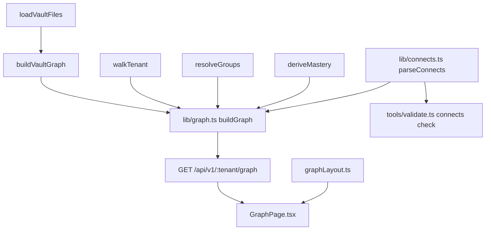

# Graph spec

*Status: current as of v1.8. Canonical formats owned elsewhere: vault and hub conventions
including the `## Connects to` block in
[second-brain/references/vault-conventions.md](../../.agents/skills/second-brain/references/vault-conventions.md),
manifests in
[generate-curriculum/references/manifest-format.md](../../.agents/skills/generate-curriculum/references/manifest-format.md),
course groups in the same vault-conventions file, ledger semantics in [progress.md](progress.md).*

## Purpose

One picture of how a tenant's learning actually hangs together, joined to the ledger. Obsidian
already renders this vault's link graph natively and with better physics, so the reason to build
another one is the part Obsidian cannot know: which notes are planned but unwritten, which
concepts the learner has proved, and which courses the learner has said connect to which. The
graph view exists to show those three things at once, over the same notes. Without it, cross-course
structure is invisible - measured before the feature was designed, every wikilink in the real
tenant was course-local, so the connective tissue between courses existed nowhere at all. The
feature therefore creates a class of edge (`meno:connects`) as well as rendering it.

## How it behaves

1. `#/t/:tenant/graph` renders every note in the tenant vault as a node and every link between
   them as an edge. The walk is the same one `lib/vault.ts` performs, so `sources/` and
   `progress/` are absent by construction - they are data directories, not notes.
2. Three visual channels, and no fourth. **Fill colour** is the course group the node's course
   resolves to (`groups.yml` through `lib/groups.ts`, falling back to the domain directory).
   **Node style** is state: `ghost` for a lesson a manifest plans but no file exists for,
   `generated` for a written note, `mastered` for a lesson whose concept the ledger says is
   mastered. **Size** is the number of distinct notes pointing at this one. A legend names all
   three; three channels are unreadable without a key.
3. Edges come from three places and are drawn at two weights. Resolved wikilinks are `reference`
   edges and `module.yml` `lessons[]` entries are `membership` edges to their course hub, both
   thin and neutral; a hub's `meno:connects` bullets are `connection` edges, thick and accented.
   Membership is what keeps a ghost node attached - a planned lesson has no file, therefore no
   wikilinks, and would otherwise float. Module `prerequisites` are deliberately not drawn: they
   are already a mermaid dependency map inside each hub, where the ordering is legible, and a
   third semantics in one undifferentiated picture is worse than the hub diagram already is.
4. Edges are undirected. An arrow would imply a semantics a connection edge cannot honestly carry
   (prerequisite? causal? see-also?) while sitting beside a mermaid DAG where arrows mean exactly
   one thing. A connection authored in either hub therefore shows in both.
5. For any pair of notes at most one edge is drawn. Where several apply, `connection` beats
   `reference` beats `membership`; a hub that both lists a lesson in its manifest and wikilinks it
   is one line, not two.
6. Interaction, all of v1: pan, zoom, drag a node, click to navigate, hover to highlight the
   one-hop neighbourhood and dim the rest with a tooltip carrying title and state. A ghost node is
   not clickable - there is no file to open - and its tooltip says so.
7. `?focus=<value>` centres one node and dims everything more than two hops from it.
   Resolution is deliberately forgiving so a link can be written without knowing the full vault
   path: an exact node id wins, else a unique basename without `.md`, else a unique path suffix,
   else nothing is focused and the whole graph renders. `LessonPage` and `CoursePage` carry a
   "Show in graph" link that uses the basename form.
8. Layout is deterministic. Each node's starting angle and radius are hashed from its id, so the
   same vault lays out identically on every load and a screenshot means something. There is no
   force slider, no search box, no time-lapse, no group filter: each of those exists in Obsidian
   to tame a hairball, and at this vault's scale, with deterministic seeding, there is no
   hairball. `?focus=` plus hover-dim is the substitute. Add them when the picture stops being
   readable, and let that be the trigger.
9. Degraded paths. A malformed `meno:connects` block costs its edges and nothing else: the hub is
   still a node, the response is still 200, and the problem lands in `warnings`. An unresolvable
   connects target is dropped from the picture and reported by validate as an error. A one-sided
   pair is drawn (edges are undirected) and reported by validate as a warning. An empty vault
   renders the onboarding empty state, not an empty canvas.
10. Nothing on this screen writes. There is no POST counterpart, no layout is saved, and dragging a
    node moves it for this session only.

## Architecture

- `lib/connects.ts` - the grammar of the `<!-- meno:connects:start -->` block: `parseConnects`
  returns well-formed `{target, display, reason, line}` entries plus levelled diagnostics. Pure
  over a markdown string. Both `lib/graph.ts` and `tools/validate.ts` parse through it; there is no
  second grammar.
- `lib/graph.ts` - the model. `buildGraph(GraphInput)` joins four already-existing producers into
  the wire shape, and `dedupeEdges` owns the collapse rule. Pure over in-memory inputs, with no
  filesystem, clock, or network, so the whole model unit-tests over synthetic file maps.
- `app/shared/types.ts` - the wire shapes (`GraphNode`, `GraphEdge`, `GraphResponse`). Defined
  there rather than re-exported from `lib/`, unlike `InsightsReport` and `CostSnapshot`, because
  the graph is a join of four producers and none of them owns the result.
- `app/server/routes.ts` - `GET /api/v1/:tenant/graph`, read-only, walking fresh per request like
  every other GET. It assembles `GraphInput` from the loaders the other endpoints already use
  (`loadVaultFiles`/`buildVaultGraph`, `walkTenant`, `readGroups`+`resolveGroups`,
  `readLedgerEvents`+`deriveMastery`) and adds no fifth walk of its own.
- `app/client/src/pages/GraphPage.tsx` - the picture: `d3-force` for physics, React-rendered SVG
  for the DOM. `d3-force` alone, not the `d3` bundle, dynamically imported exactly as
  `mermaid.tsx` imports mermaid, so a learner who never opens this page never downloads it. SVG
  rather than canvas at this scale buys free hit testing, CSS theming, and real elements for the
  accessibility tree.
- `app/client/src/graphLayout.ts` - the pure half of the view: id hashing and seed positions,
  focus resolution, and n-hop neighbourhood sets. A `.ts` file among `.tsx` on purpose, for the
  same reason `courseList.ts` is: the root `tsconfig` compiles `app/**/*.ts` without the DOM lib,
  so naming a browser global there fails typecheck instead of failing review, and `node --test`
  covers it like the server.
- `tools/validate.ts` - the `connects` check.

## Data touched

**This subsystem writes nothing.** Every row below is a read, there is no POST counterpart to the
endpoint, and no node position, zoom level, or focus is persisted anywhere - not on disk, not in
`localStorage`. Dragging a node changes the current render and nothing else.

| Path or endpoint | Access | Owner | Format |
|---|---|---|---|
| `content/tenants/<tenant>/**/*.md` (via `lib/vault.ts`) | read | server | [vault-conventions.md](../../.agents/skills/second-brain/references/vault-conventions.md) |
| `content/tenants/<tenant>/<domain>/<slug>/course.yml`, `modules/*/module.yml` | read | server via `walkTenant` | [manifest-format.md](../../.agents/skills/generate-curriculum/references/manifest-format.md) |
| the `meno:connects` block inside each `<slug>-hub.md` | read | agents via `second-brain` | [vault-conventions.md](../../.agents/skills/second-brain/references/vault-conventions.md) |
| `content/tenants/<tenant>/groups.yml` | read | agents via `second-brain`, or the learner by hand | [vault-conventions.md](../../.agents/skills/second-brain/references/vault-conventions.md), `groups.schema.json` |
| `content/tenants/<tenant>/progress/ledger.jsonl` | read | tutor and server | [progress.md](progress.md) |
| `content/tenants/<tenant>/progress/mastery.yml` | never (derives in memory) | tutor only | [progress.md](progress.md) |
| `GET /api/v1/:tenant/graph` | read | server | this spec |
| browser storage | never | - | - |

## Invariants

1. Every markdown file the `lib/vault.ts` walk covers is exactly one node, and nothing under
   `sources/` or `progress/` is ever a node.
2. Every `lessons[]` entry in every `module.yml` is a node whether or not its file exists; one
   with no file has `state: 'ghost'` and `route: null`, and it keeps the same `id` once the body
   is written.
3. Only a lesson node is ever `state: 'mastered'`, and only when `deriveMastery` puts that
   lesson's manifest `concept` at level `mastered` in that course. Every other node with a file is
   `generated`.
4. Every edge endpoint is the id of a node in the same response, and no edge has
   `source === target`. A broken wikilink is not an edge.
5. Any unordered pair of nodes carries at most one edge, and its `kind` is the highest of
   `connection` > `reference` > `membership` present for that pair.
6. `reason` is set only on a `connection` edge, never on the other two kinds.
7. A node's `in_degree` equals the number of distinct nodes that are the `source` of a
   deduplicated edge whose `target` is that node.
8. `buildGraph` is pure and deterministic: the same input yields byte-identical JSON, with nodes
   sorted by `id` and edges by (`source`, `target`, `kind`), and it reads no clock, no filesystem,
   and no network.
9. The graph response carries structure only - each node has exactly the keys `id`, `title`,
   `kind`, `group`, `course`, `state`, `in_degree`, `route` - and no lesson body, check answer, or
   explanation is reachable through it.
10. A malformed, unbalanced, or absent `meno:connects` block never removes a node and never
    fails a request: the hub still appears, the endpoint still answers 200, and the problem lands
    in `warnings`.
11. `parseConnects` reports every malformed line with its own 1-based line number and returns no
    entry for it, and it never throws on any input.
12. Validate reports an unresolvable `meno:connects` target as an error and a one-sided pair as a
    warning, and maps each parser diagnostic straight onto its own `level`.
13. Focus resolution is exact id, then unique basename, then unique path suffix, then nothing;
    an ambiguous or unknown `?focus=` value renders the whole graph rather than an error.
14. Layout seeding is a pure function of the node id and the node count - no clock, no randomness -
    and `app/client/src/graphLayout.ts` names no browser global and imports no React.
15. The graph subsystem writes nothing: no route mutates a file for it and no view state is
    persisted.

## Verified by

- Invariants 1-8: `tools/test/graph.test.ts`, over synthetic in-memory file maps (no fixture, no
  disk).
- Invariants 9, 10, 15: `app/test/graph.test.ts`, over a throwaway copy of the example tenant -
  the exact key set of a node, a hub with a deliberately broken block still answering 200, and a
  structural assertion that the route table exposes exactly one `graph` route and that it is a
  `GET`.
- Invariants 11, 12: `tools/test/connects.test.ts` (the grammar and every malformed shape) and the
  `connects` cases in `tools/test/validate.test.ts` (error and warning levels as findings).
- Invariants 13, 14: `app/test/graph-layout.test.ts`, which unit-tests `graphLayout.ts` the way
  `app/test/course-list.test.ts` unit-tests `courseList.ts`, plus a source grep for browser
  globals and React imports.
- The second course in `examples/example-learner/` is the living spec: a reciprocal
  `meno:connects` pair, membership edges, and two ghost lessons, all of it covered by
  `npm run validate` in the gate.
- **Not visually verified.** The picture itself - force convergence, the three channels reading
  apart at a glance, dark mode, hover dimming - is reasoned about rather than observed, in the
  same honest position as the guidebook and the v1.6 course list. Worth one manual pass in a
  browser before trusting it.

## Open questions

1. Whether cross-course edges should ever be written by anything other than an explicit
   `second-brain` sweep. Today a new course is invisible in the graph until someone asks for one,
   which was chosen over a writer that would clobber judgment it cannot reproduce. Revisit if the
   staleness bites in practice.
2. Whether a local-graph panel belongs on `LessonPage` after all. Cut from v1 as a second
   interaction model built for a scale (~300 or more notes) this vault has not reached, on the
   densest page in the app. Revisit when the vault crosses it.
3. Whether size should be driven by something other than incoming links. `home.md` links out to
   every hub and is linked back by few, so it renders as the centre of a star but not as a large
   node - truthful under the stated rule, and arguably surprising. Revisit if it reads wrong once
   observed in a browser.
4. Whether `state` should have a fourth value for a written but never-studied lesson. Today
   `generated` covers both "written" and "read but unproven"; splitting it would need a fourth
   node style, which is exactly the channel budget this view refused to exceed.
