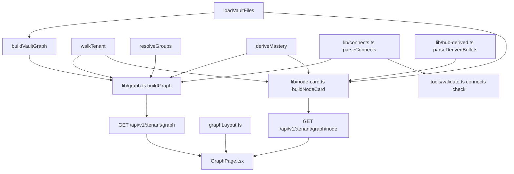

# Graph spec

*Status: current as of v1.19. Canonical formats owned elsewhere: vault and hub conventions
including the `## Connects to` block in
[second-brain/references/vault-conventions.md](../../.agents/skills/second-brain/references/vault-conventions.md),
manifests in
[generate-curriculum/references/manifest-format.md](../../.agents/skills/generate-curriculum/references/manifest-format.md),
course groups in the same vault-conventions file, ledger semantics in [progress.md](progress.md).*

## Purpose

One picture of how a tenant's learning actually hangs together, joined to the ledger. Obsidian
already renders this vault's link graph natively and with better physics, so the reason to build
another one is the part Obsidian cannot know: which notes are planned but unwritten, which
concepts the learner has proved, and which courses the learner has said connect to which. The
graph view exists to show those three things at once, over the same notes. Without it, cross-course
structure is invisible - measured before the feature was designed, every wikilink in the real
tenant was course-local, so the connective tissue between courses existed nowhere at all. The
feature therefore creates a class of edge (`meno:connects`) as well as rendering it.

## How it behaves

1. `#/t/:tenant/graph` renders every note in the tenant vault as a node and every link between
   them as an edge. The walk is the same one `lib/vault.ts` performs, so `sources/` and
   `progress/` are absent by construction - they are data directories, not notes.
2. Three visual channels, and no fourth. **Fill colour** is the course group the node's course
   resolves to (`groups.yml` through `lib/groups.ts`, falling back to the domain directory).
   **Node style** is state: `ghost` for a lesson a manifest plans but no file exists for,
   `generated` for a written note, `mastered` for a lesson whose concept the ledger says is
   mastered. **Size** is the number of distinct notes pointing at this one. A legend names all
   three; three channels are unreadable without a key. The group filter (item 11) is a control
   over which nodes render, not a fourth channel painted onto them.
3. Edges come from three places and are drawn at two weights. Resolved wikilinks are `reference`
   edges and `module.yml` `lessons[]` entries are `membership` edges to their course hub, both
   thin and neutral; a hub's `meno:connects` bullets are `connection` edges, thick and accented.
   Membership is what keeps a ghost node attached - a planned lesson has no file, therefore no
   wikilinks, and would otherwise float. Module `prerequisites` are deliberately not drawn: they
   are already a mermaid dependency map inside each hub, where the ordering is legible, and a
   third semantics in one undifferentiated picture is worse than the hub diagram already is.
4. Edges are undirected. An arrow would imply a semantics a connection edge cannot honestly carry
   (prerequisite? causal? see-also?) while sitting beside a mermaid DAG where arrows mean exactly
   one thing. A connection authored in either hub therefore shows in both.
5. For any pair of notes at most one edge is drawn. Where several apply, `connection` beats
   `reference` beats `membership`; a hub that both lists a lesson in its manifest and wikilinks it
   is one line, not two.
6. Interaction: pan, zoom, drag a node, hover to highlight the one-hop neighbourhood and dim the
   rest with a tooltip carrying title and state, and **click to open the node's card** (item 12).
   Click used to navigate straight to the node's page; since v1.19 it does not, and the card's own
   button is the only way out of the canvas. Every node kind opens a card, ghosts included - a
   ghost has no file to open, which is a thing the card can now say instead of a click that
   silently does nothing.
7. `?focus=<value>` centres one node and dims everything more than two hops from it.
   Resolution is deliberately forgiving so a link can be written without knowing the full vault
   path: an exact node id wins, else a unique basename without `.md`, else a unique path suffix,
   else nothing is focused and the whole graph renders. `LessonPage` and `CoursePage` carry a
   "Show in graph" link that uses the basename form.
8. Layout is deterministic. Each node's starting angle and radius are hashed from its id, so the
   same vault lays out identically on every load and a screenshot means something. There is still
   no force slider, no search box, no time-lapse: each of those exists in Obsidian to tame a
   hairball, and at this vault's scale, with deterministic seeding, there is no hairball.
   `?focus=` plus hover-dim is the substitute. Add them when the picture stops being readable, and
   let that be the trigger. The group filter (item 11) was cut from v1 on the same reasoning,
   sized to a 92-node estimate; the real tenant vault renders 198 nodes, 106 of them ghosts, which
   is a hairball by any definition, so v1.9 reverses that one cut and adds the filter back.
9. Degraded paths. A malformed `meno:connects` block costs its edges and nothing else: the hub is
   still a node, the response is still 200, and the problem lands in `warnings`. An unresolvable
   connects target is dropped from the picture and reported by validate as an error. A one-sided
   pair is drawn (edges are undirected) and reported by validate as a warning. An empty vault
   renders the onboarding empty state, not an empty canvas.
10. Nothing on this screen writes. There is no POST counterpart, no layout is saved, and dragging a
    node moves it for this session only.
11. The group filter lives with the legend - the legend names what a fill colour means, the
    filter turns that colour on and off, so one control does both. One toggle per entry in
    `groups`, plus a synthetic "Ungrouped" toggle only when at least one node has `group === null`
    (the tenant home note and `todos.md` carry no course group); each toggle shows the group's
    swatch, its title, and how many nodes currently belong to it, counted over the full,
    unfiltered node list so a toggle always shows what it is about to hide. Every group starts
    visible, so the graph looks exactly as it does today on first load. Hiding a group removes its
    nodes and every edge with a now-missing endpoint from the `d3-force` input, not just from the
    paint - otherwise the physics keeps fighting over nodes nobody can see - and the simulation
    re-runs and re-fits to the visible subgraph on every toggle, the same way it re-fits on a fresh
    load; an explicit `?focus=` still takes priority over fitting either way. Turning every group
    off renders the same empty state an unfiltered empty vault renders, not a blank canvas, with
    the filter panel still visible so a group can be turned back on - there is no other way back
    in, since filter state is component state only and is deliberately never written to the URL
    (nothing links into a *filtered* graph the way `LessonPage`/`CoursePage` link into a focused
    one). A separate notice above the canvas tells the maintainer to run a `second-brain` sweep
    when the graph has nodes but no `connection` edge at all; that notice is computed from the
    full, unfiltered edge list and must never react to the filter - it means the sweep has not run
    yet, not that the filter is currently hiding the one `connection` edge that exists.
12. **The node card.** Clicking a node, or pressing Enter or Space on a focused one, opens a card
    pinned to a corner of the canvas. It is deliberately **not** a modal: no `role="dialog"`, no
    focus trap, no `aria-live`. The graph stays live underneath - pan, zoom, drag and hover all
    keep working, and clicking a different node swaps the card's contents in place rather than
    stacking a second one. Escape closes it, as does the card's own close button; nothing else
    does, because a card that vanished on the first background click would fight the pan gesture
    it shares a surface with. A modal was rejected on the same reasoning the tooltip was built
    on: the whole value of the card is reading a node's description *while still looking at where
    it sits*, and a dialog that dims the graph destroys exactly that.
    Contents vary by kind and are fetched per card from the endpoint in item 13, never from the
    graph payload: a `hub` shows its `course.yml` objectives plus lessons-done-over-total for that
    course, a `lesson` shows the one-line description its course hub note already wrote for it in
    the `meno:derived` block, `home` shows a description and the same counts across every course,
    and a plain `note` shows its first paragraph. The card's single bottom button is the only
    navigation out of the canvas, and for a `hub` it goes to the course page, not to the raw hub
    markdown the node's own `route` points at. A ghost lesson gets a card too, saying the lesson
    is planned but not written, with that button drawn and disabled.
13. **A per-node endpoint, not a wider node.** The card's prose comes from
    `GET /api/v1/:tenant/graph/node?id=<node id>`, hit when a card opens. It is not three more
    fields on `GraphNode`, because that would ship per-node prose for every node on every graph
    load to serve one card at a time, and because the eight-key node shape of invariant 9 is a
    guarded leak boundary worth keeping narrow. The new endpoint carries its own equivalent
    boundary (invariant 18): it serves prose *about* a lesson and never any part of the lesson
    body, which is why a lesson's description is read out of the hub note rather than out of the
    lesson file, where `answer`, `explain` and `checks` live. An `id` the current graph does not
    contain answers 404 rather than 200 - invariant 10's tolerance is about malformed *vault
    content*, which the learner cannot be expected to fix mid-session, not about a malformed
    *request*, and the client only ever sends an id it read out of a graph response it holds.
    Resolution is against the node set, never the filesystem, so a ghost id (no file, real node)
    answers 200 and a traversal attempt is simply not a node.
14. **Canvas controls.** Zoom in, zoom out and fit-to-view get visible buttons beside the legend;
    the wheel and background-drag gestures that already existed stay, and both routes go through
    the same clamp, so no path can leave the 0.2x-4x range. A fullscreen toggle expands the canvas
    with CSS (`position: fixed; inset: 0`) rather than the Fullscreen API - the API's
    permission-and-event dance buys nothing here, cannot be exercised by any test this repo has,
    and takes the page out of the app's own header and theming. The canvas fills the height
    available to it rather than letterboxing the square 900-unit viewBox inside a fixed `70vh`.
    None of this survives a reload: zoom, pan, fullscreen and which card is open are component
    state only, never `localStorage` and never the URL, so invariant 14's determinism claim - the
    same vault lays out identically on every load - keeps meaning what it says.

## Architecture

- `lib/connects.ts` - the grammar of the `<!-- meno:connects:start -->` block: `parseConnects`
  returns well-formed `{target, display, reason, line}` entries plus levelled diagnostics. Pure
  over a markdown string. Both `lib/graph.ts` and `tools/validate.ts` parse through it; there is no
  second grammar.
- `lib/hub-derived.ts` - the grammar of the `<!-- meno:derived -->` block's wikilink bullets, the
  sibling of `lib/connects.ts` and written to the same contract: pure over a markdown string, never
  throws, and returns nothing at all for absent or unbalanced markers (`tools/validate.ts` already
  owns reporting that imbalance, so this file does not duplicate the diagnostic). One grammar
  serves two levels, because a hub's bullets describe its lessons and `home.md`'s bullets describe
  the courses in exactly the same shape.
- `lib/node-card.ts` - the card model. `buildNodeCard(NodeCardInput)` returns the whole payload for
  one node, or `null` for an id the node set does not contain, which is the route's 404. Pure over
  the same in-memory producers `buildGraph` takes, for the same reason: no filesystem, no clock, no
  network, so every kind and the ghost case unit-test over synthetic file maps. Separate from
  `lib/graph.ts` rather than folded into it because the two answer different requests - one is
  every node's structure, the other is one node's prose - and because the join layer has no reason
  to grow a second output shape.
- `lib/graph.ts` - the model. `buildGraph(GraphInput)` joins four already-existing producers into
  the wire shape, and `dedupeEdges` owns the collapse rule. Pure over in-memory inputs, with no
  filesystem, clock, or network, so the whole model unit-tests over synthetic file maps.
- `app/shared/types.ts` - the wire shapes (`GraphNode`, `GraphEdge`, `GraphResponse`, and since
  v1.19 `NodeCardResponse` and the four shapes under it). Defined
  there rather than re-exported from `lib/`, unlike `InsightsReport` and `CostSnapshot`, because
  the graph is a join of four producers and none of them owns the result.
- `app/server/routes.ts` - `GET /api/v1/:tenant/graph`, read-only, walking fresh per request like
  every other GET. It assembles `GraphInput` from the loaders the other endpoints already use
  (`loadVaultFiles`/`buildVaultGraph`, `walkTenant`, `readGroups`+`resolveGroups`,
  `readLedgerEvents`+`deriveMastery`) and adds no fifth walk of its own. Since v1.19 it also
  serves `GET /api/v1/:tenant/graph/node?id=<node id>` from the same loaders (minus groups, which
  a card does not use), the subsystem's second and last GET. Both are reads; there is still no
  POST counterpart to either.
- `app/client/src/pages/GraphPage.tsx` - the picture: `d3-force` for physics, React-rendered SVG
  for the DOM. `d3-force` alone, not the `d3` bundle, dynamically imported exactly as
  `mermaid.tsx` imports mermaid, so a learner who never opens this page never downloads it. SVG
  rather than canvas at this scale buys free hit testing, CSS theming, and real elements for the
  accessibility tree.
- `app/client/src/graphLayout.ts` - the pure half of the view: id hashing and seed positions,
  focus resolution, n-hop neighbourhood sets, and (since v1.9) the group filter's two pure
  functions - `groupCounts` for the legend/filter toggle labels and `filterGraphByGroups` for the
  visible subgraph handed to `d3-force` - and (since v1.19) the zoom controls' arithmetic:
  `ZOOM_LIMITS`, `ZOOM_STEP_FACTOR`, `clampZoom` and `zoomAboutCenter`. The buttons and the wheel
  handler both scale through `zoomAboutCenter`, so there is one clamp and one anchor point rather
  than two. A `.ts` file among `.tsx` on purpose, for the same reason
  `courseList.ts` is: the root `tsconfig` compiles `app/**/*.ts` without the DOM lib, so naming a
  browser global there fails typecheck instead of failing review, and `node --test` covers it like
  the server.
- `tools/validate.ts` - the `connects` check.

### The pure seam (v1.19)

This repository has no jsdom, no testing-library and no browser driver, so anything that stays
inside a React component is unguardable by construction. These signatures are the contract: what
must be a pure, DOM-free function so `node --test` can hold it, and where each one lives. Bodies
belong to the implementers; the shapes here do not.

```ts
// lib/hub-derived.ts - the meno:derived bullet grammar, sibling of lib/connects.ts.
// Pure over a markdown string. Never throws. One grammar for both levels: a hub's
// bullets describe its lessons, home.md's bullets describe its courses.
export const DERIVED_START = '<!-- meno:derived:start -->';
export const DERIVED_END = '<!-- meno:derived:end -->';
export interface DerivedBullet {
  target: string;        // wikilink target, trimmed, unresolved - resolution is the caller's job
  display: string | null;
  description: string;   // the text after the " - " separator, trimmed, never empty
  line: number;          // 1-based, within the markdown parsed
}
export function parseDerivedBullets(markdown: string): DerivedBullet[];
/** The description whose bullet target's basename (minus `.md`) equals `targetBasename`. */
export function derivedDescriptionFor(markdown: string, targetBasename: string): string | null;

// lib/node-card.ts - the card model. Pure over the same in-memory producers buildGraph takes.
export interface NodeCardInput {
  tenant: string;
  id: string;                 // the requested GraphNode.id
  files: VaultFile[];         // loadVaultFiles(tenantDir)
  vault: VaultGraph;          // buildVaultGraph(files) - resolves home.md's hub wikilinks
  tree: TreeResponse;         // walkTenant(tenantDir, tenant)
  mastery: Mastery;           // deriveMastery(readLedgerEvents(tenantDir))
}
/** Null for an id the node set does not contain - that null is the route's 404. */
export function buildNodeCard(input: NodeCardInput): NodeCardResponse | null;
/** Lessons-done-over-total over whichever courses are in scope (one, or all of them). */
export function courseLessonProgress(
  courses: readonly CourseNode[],
  fileIds: ReadonlySet<string>,
  mastery: Mastery,
): NodeCardProgress;
/** First ordinary paragraph: no heading, no derived/connects block, no wikilink-only line. */
export function noteIntro(markdown: string, maxChars: number): string | null;
export interface ActionTarget {
  tenant: string;
  kind: GraphNodeKind;
  state: GraphNodeState;
  id: string;                                                    // vault path, for noteHref
  course: string | null;                                         // slug, for courseHref on a hub
  lesson: { course: string; module: string; file: string } | null; // for lessonHref
}
export function nodeCardAction(target: ActionTarget): NodeCardAction;

// app/client/src/graphLayout.ts - the zoom arithmetic. Same rules the rest of the file lives
// under: no browser global, no React import, no clock, no randomness.
export const ZOOM_LIMITS: { min: number; max: number }; // 0.2, 4 - moved off GraphPage.tsx
export const ZOOM_STEP_FACTOR: number;                  // what one +/- press multiplies by
export function clampZoom(k: number): number;
/**
 * Scale by `factor` about the viewport centre, which is the svg user-space origin because the
 * viewBox is centred there. Keeps the graph point currently under the centre under the centre,
 * clamped to ZOOM_LIMITS. The +/- buttons pass ZOOM_STEP_FACTOR and its reciprocal; the wheel
 * handler passes its own factor through the same function, so there is one clamp, not two.
 */
export function zoomAboutCenter(t: FitTransform, factor: number): FitTransform;
```

What is deliberately NOT in the seam: which corner the card is pinned to, the Escape key handler,
the fullscreen class toggle, and the card's fetch lifecycle. Each is a component concern with no
arithmetic in it, and inventing a pure function to wrap one would buy a test that asserts nothing
a reader could not see. `getJson<NodeCardResponse>` already covers the fetch, so `api.tsx` needs
no change.



## Data touched

**This subsystem writes nothing.** Every row below is a read, there is no POST counterpart to
either endpoint, and no node position, zoom level, fullscreen flag, open card, or focus is
persisted anywhere - not on disk, not in `localStorage`. Dragging a node changes the current render
and nothing else.

| Path or endpoint | Access | Owner | Format |
|---|---|---|---|
| `content/tenants/<tenant>/**/*.md` (via `lib/vault.ts`) | read | server | [vault-conventions.md](../../.agents/skills/second-brain/references/vault-conventions.md) |
| `content/tenants/<tenant>/<domain>/<slug>/course.yml`, `modules/*/module.yml` | read | server via `walkTenant` | [manifest-format.md](../../.agents/skills/generate-curriculum/references/manifest-format.md) |
| the `meno:connects` block inside each `<slug>-hub.md` | read | agents via `second-brain` | [vault-conventions.md](../../.agents/skills/second-brain/references/vault-conventions.md) |
| the `meno:derived` block inside each `<slug>-hub.md` and inside `home.md` | read | agents via `second-brain` | [vault-conventions.md](../../.agents/skills/second-brain/references/vault-conventions.md) |
| `content/tenants/<tenant>/groups.yml` | read | agents via `second-brain`, or the learner by hand | [vault-conventions.md](../../.agents/skills/second-brain/references/vault-conventions.md), `groups.schema.json` |
| `content/tenants/<tenant>/progress/ledger.jsonl` | read | tutor and server | [progress.md](progress.md) |
| `content/tenants/<tenant>/progress/mastery.yml` | never (derives in memory) | tutor only | [progress.md](progress.md) |
| `GET /api/v1/:tenant/graph` | read | server | this spec |
| `GET /api/v1/:tenant/graph/node?id=` | read | server | this spec |
| lesson body text | loaded by the vault walk, never served - a lesson card's description comes from its hub note | - | invariant 18 |
| browser storage | never | - | - |

## Invariants

1. Every markdown file the `lib/vault.ts` walk covers is exactly one node, and nothing under
   `sources/` or `progress/` is ever a node.
2. Every `lessons[]` entry in every `module.yml` is a node whether or not its file exists; one
   with no file has `state: 'ghost'` and `route: null`, and it keeps the same `id` once the body
   is written.
3. Only a lesson node is ever `state: 'mastered'`, and only when `deriveMastery` puts that
   lesson's manifest `concept` at level `mastered` in that course. Every other node with a file is
   `generated`.
4. Every edge endpoint is the id of a node in the same response, and no edge has
   `source === target`. A broken wikilink is not an edge.
5. Any unordered pair of nodes carries at most one edge, and its `kind` is the highest of
   `connection` > `reference` > `membership` present for that pair.
6. `reason` is set only on a `connection` edge, never on the other two kinds.
7. A node's `in_degree` equals the number of distinct nodes that are the `source` of a
   deduplicated edge whose `target` is that node.
8. `buildGraph` is pure and deterministic: the same input yields byte-identical JSON, with nodes
   sorted by `id` and edges by (`source`, `target`, `kind`), and it reads no clock, no filesystem,
   and no network.
9. The graph response carries structure only - each node has exactly the keys `id`, `title`,
   `kind`, `group`, `course`, `state`, `in_degree`, `route` - and no lesson body, check answer, or
   explanation is reachable through it.
10. A malformed, unbalanced, or absent `meno:connects` block never removes a node and never
    fails a request: the hub still appears, the endpoint still answers 200, and the problem lands
    in `warnings`.
11. `parseConnects` reports every malformed line with its own 1-based line number and returns no
    entry for it, and it never throws on any input.
12. Validate reports an unresolvable `meno:connects` target as an error and a one-sided pair as a
    warning, and maps each parser diagnostic straight onto its own `level`.
13. Focus resolution is exact id, then unique basename, then unique path suffix, then nothing;
    an ambiguous or unknown `?focus=` value renders the whole graph rather than an error.
14. Layout seeding is a pure function of the node id and the node count - no clock, no randomness -
    and `app/client/src/graphLayout.ts` names no browser global and imports no React.
15. The graph subsystem writes nothing: no route mutates a file for it, and no view state -
    node positions, zoom, pan, fullscreen, the group filter, or which card is open - is persisted
    to disk, to `localStorage`, or to the URL.
16. `groupCounts` returns one row per group in the server's own order, each counted over the
    full, unfiltered node list, plus a synthetic `id: null` "Ungrouped" row - and only that row -
    when at least one node has `group === null`; a vault where every node sits in some group gets
    no such row at all.
17. `filterGraphByGroups` returns exactly the nodes whose `group` is in the visible-groups set
    (`null` included for the ungrouped bucket) and only the edges whose BOTH endpoints survive
    that cut; every group hidden yields an empty subgraph, never a throw.
18. **The card leak rule**, invariant 9's counterpart for the per-node endpoint. A
    `GET /api/v1/:tenant/graph/node` response has exactly the keys `tenant`, `id`, `title`,
    `kind`, `state`, `course`, `summary`, `summary_source`, `objectives`, `progress`, `action`,
    `warnings`; each `objectives[]` entry has exactly `id` and `text`; `progress`, when not null,
    has exactly `lessons_total`, `lessons_generated`, `lessons_mastered`, `courses`; `action` has
    exactly `href`, `label`, `enabled`, `disabled_reason`. The serialized response contains none
    of the strings `"answer"`, `"explain"`, `"checks"`, `"html"`, `"frontmatter"`, and no part of
    any lesson body: a lesson's `summary` is read from its course hub note's `meno:derived` block
    and from nowhere else, and no `note-intro` summary is ever produced for a node whose id sits
    under a course's `modules/` directory, so a stray markdown file next to a lesson cannot
    become a hole in this rule.
19. A card is served for exactly the ids in the graph's node set. A ghost id answers 200 with
    `state: 'ghost'`, `action.enabled: false`, `action.href: null` and a non-null
    `disabled_reason`; an id the node set does not contain answers 404 without touching the
    filesystem; a missing or empty `id` parameter answers 400. `action.href` is null if and only
    if `action.enabled` is false, and for a `hub` it is the course page, never the hub note.
20. `parseDerivedBullets` never throws on any input and yields no bullet for a malformed line,
    for absent markers, or for unbalanced markers; a hub whose derived block is unreadable still
    gets a card, with `summary: null`, `summary_source: 'none'`, and the problem in `warnings`.
21. Clicking a node, or pressing Enter or Space on a focused node, opens that node's card and
    navigates nowhere - for every kind and every state, ghosts included. The only navigation off
    the graph page from the canvas is the card's action button.
22. Every zoom path - wheel, the zoom buttons, fit-to-view - produces a scale within
    `ZOOM_LIMITS` (0.2 to 4), and `clampZoom` and `zoomAboutCenter` are pure functions of their
    arguments with no clock, no randomness, and no browser global.

## Verified by

- Invariants 1-8: `tools/test/graph.test.ts`, over synthetic in-memory file maps (no fixture, no
  disk).
- Invariants 9, 10, 15: `app/test/graph.test.ts`, over a throwaway copy of the example tenant -
  the exact key set of a node, a hub with a deliberately broken block still answering 200, and a
  structural assertion that the route table exposes exactly one `graph` route and that it is a
  `GET`.
- Invariants 11, 12: `tools/test/connects.test.ts` (the grammar and every malformed shape) and the
  `connects` cases in `tools/test/validate.test.ts` (error and warning levels as findings).
- Invariants 13, 14: `app/test/graph-layout.test.ts`, which unit-tests `graphLayout.ts` the way
  `app/test/course-list.test.ts` unit-tests `courseList.ts`, plus a source grep for browser
  globals and React imports.
- Invariants 16, 17: `app/test/graph-layout.test.ts`, the `groupCounts` and `filterGraphByGroups`
  blocks - server-order rows plus a conditional Ungrouped row, the identity when every group is
  visible, hiding one group dropping its nodes and every edge touching them (including a
  cross-group edge whose OTHER endpoint stayed visible), hiding only the ungrouped bucket, and
  every group hidden yielding an empty subgraph rather than a crash.
- Invariants 18, 19: `app/test/graph-node-card.test.ts`, over the same throwaway copy of the
  example tenant `app/test/graph.test.ts` uses - the exact key set at every level of the payload
  for one node of each of the four kinds, the same grep-the-serialized-JSON assertion invariant 9
  is proved with, a ghost id answering 200 with a disabled action, an unknown id answering 404, a
  traversal id (`../../etc/passwd`) answering 404 rather than reading anything, a missing `id`
  answering 400, and the structural assertion that the route table exposes exactly two `graph`
  routes and that both are `GET`s.
- Invariant 20: `tools/test/node-card.test.ts`, the `parseDerivedBullets` block - every malformed
  bullet shape, absent markers, unbalanced markers, and a hub whose block is a single unclosed
  marker - plus `buildNodeCard` over synthetic file maps for each kind, the ghost case, and the
  three `progress` counters.
- Invariant 22: `app/test/graph-layout.test.ts`, the `clampZoom` and `zoomAboutCenter` blocks -
  both ends of the range, a step that would overshoot, and the fixed-point property that the graph
  point at the viewport centre stays at the viewport centre across a zoom step.
- **Invariant 21 is not gate-covered**, and cannot be here: it is a claim about a React event
  handler, and this repository has no jsdom, no testing-library, and no browser driver. The
  closest the gate gets is a source grep, which would prove the handler names the card setter and
  not `navigate`, and would not prove a click reaches it.
- The second course in `examples/example-learner/` is the living spec: a reciprocal
  `meno:connects` pair, membership edges, and two ghost lessons, all of it covered by
  `npm run validate` in the gate.
- **Not visually verified.** The picture itself - force convergence, the three channels reading
  apart at a glance, dark mode, hover dimming - is reasoned about rather than observed, in the
  same honest position as the guidebook and the v1.6 course list. The group filter added in v1.9
  is in the same position: the pure counting and subgraph-cut functions are unit-tested, but the
  checkbox interaction, the refit-after-toggle behaviour, and the composition that keeps the
  no-connections notice reacting to the unfiltered edge list rather than the filtered one are
  reasoned about from the source, not observed. Worth one manual pass in a browser before trusting
  either. **Everything the card and the canvas controls added in v1.19 is in the same position,
  and more of it than usual.** The payload behind the card is unit-tested and HTTP-tested; the
  card itself is not. That a click opens it rather than navigating, that a second click swaps its
  contents instead of stacking a card, that Escape closes it, that it stays readable pinned to a
  corner over a live graph, that the zoom buttons and fit-to-view feel right, that the CSS
  fullscreen toggle actually escapes its containing stacking context and restores cleanly, and
  that a canvas filling its available height does not break the label-spacing maths that assumed a
  letterboxed square - all of that is verified by hand in a browser and by nothing else. Read a
  green gate on this feature as evidence about the server and the arithmetic only.

## Open questions

1. Whether cross-course edges should ever be written by anything other than an explicit
   `second-brain` sweep. Today a new course is invisible in the graph until someone asks for one,
   which was chosen over a writer that would clobber judgment it cannot reproduce. Revisit if the
   staleness bites in practice.
2. Whether a local-graph panel belongs on `LessonPage` after all. Cut from v1 as a second
   interaction model built for a scale (~300 or more notes) this vault has not reached, on the
   densest page in the app. Revisit when the vault crosses it.
3. Whether size should be driven by something other than incoming links. `home.md` links out to
   every hub and is linked back by few, so it renders as the centre of a star but not as a large
   node - truthful under the stated rule, and arguably surprising. Revisit if it reads wrong once
   observed in a browser.
4. Whether `state` should have a fourth value for a written but never-studied lesson. Today
   `generated` covers both "written" and "read but unproven"; splitting it would need a fourth
   node style, which is exactly the channel budget this view refused to exceed.
5. Whether the group filter's selection should ever survive a reload. Deliberately cut from v1.9:
   `?focus=` exists because `LessonPage` and `CoursePage` link into a focused graph, but nothing
   links into a *filtered* one, and persisting filter state would mean generalizing the router's
   single-purpose query handling for no current consumer. Component state only for now; revisit if
   a future page wants to link in with a group already hidden.
6. Whether `GraphNode.route` for a `hub` should become the course page too. The card's action
   button goes there (item 12), so the two now disagree about where a hub node "is". Left alone
   deliberately in v1.19: `route` is stable surface with other consumers, and changing it is a
   behaviour change to the graph payload rather than an addition. Revisit if a second consumer
   wants the course page.
7. Whether a hub's `summary` should fall back to something when `home.md` carries no derived
   bullet for that course. Today it is simply absent and the card leads with objectives, which is
   the design's own answer for a hub. A course with neither a home bullet nor objectives shows a
   card with a title and counts only - acceptable, and a signal the `second-brain` sweep has not
   run.
