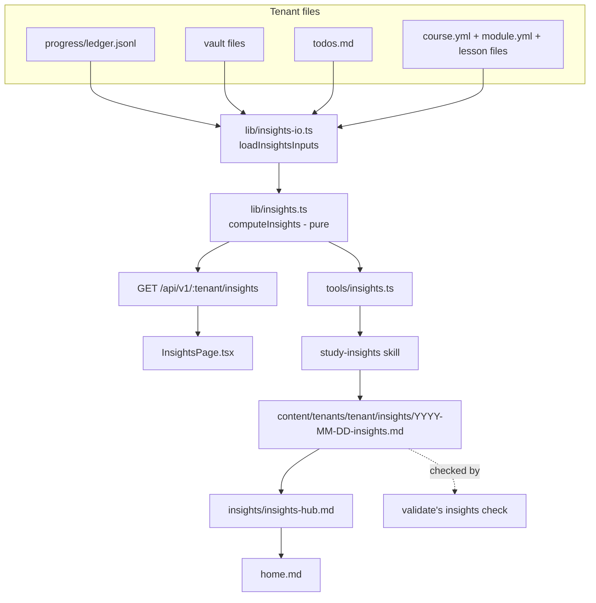

# Insights spec

*Status: current as of the v1.1 insights addition (2026-08-05). Canonical formats owned
elsewhere: ledger event semantics in [progress.md](progress.md); vault conventions
(wikilinks, hub notes, orphans) in
[second-brain/references/vault-conventions.md](../../.agents/skills/second-brain/references/vault-conventions.md);
todo syntax in
[second-brain/references/todo-format.md](../../.agents/skills/second-brain/references/todo-format.md);
narrative report format in
[study-insights/references/narrative-format.md](../../.agents/skills/study-insights/references/narrative-format.md).
This spec owns the metric definitions and the read-only surface (endpoint, CLI, page); the
machine contract for narrative notes is `schemas/insights.schema.json`.*

## Purpose

A learner using Meno for weeks has no honest way to see their own study data except by
reading raw ledger lines. Insights closes that gap without becoming a second gate: one
pure function (`computeInsights`, `lib/insights.ts`) turns the ledger, the vault graph,
todos, and course manifests into a snapshot of counts, dates, and rates - every rate
carrying its denominator, every distribution null below a stated minimum sample size
rather than a fabricated trend. Three things read that snapshot (the localhost app, a CLI,
and an on-demand narrative-writing skill); nothing computes a second version of it. Without
this subsystem, a learner's only view into "am I actually making progress" is the mastery
gate itself - a pass/fail signal that was never meant to double as a progress dashboard,
and conflating the two would make gates feel punitive.

## How it behaves

1. `computeInsights(events, vault, todos, manifests, asOf)` is pure: given the same five
   inputs it returns byte-identical JSON, always - `asOf` is a parameter because the
   function never reads the clock, mirroring the rule `lib/mastery.ts` already holds to.
2. Every rate (`Rate = { value, n, of, reason? }`) reports `of` alongside `value`; when
   `of` is 0 the report returns `value: null, reason: 'insufficient_data'` rather than 0 or
   any other number that would read as a real measurement.
3. `sessions.median_gap_days` is null below 4 distinct sessions - a two-point median is
   noise dressed as a trend, so the report says "not enough data" instead of showing one.
4. Gate overrides that never earned a repaying agent-graded transfer score afterward
   surface as `gates.unrepaid_overrides`, named individually (course, concept, the exact
   `gate_ts` join key, `reinject_after`) - this is the single most actionable fact the
   report can produce, so every surface (CLI, endpoint, page, narrative note) calls it out
   rather than folding it into a generic count.
5. `GET /api/v1/:tenant/insights` walks the tenant tree fresh (same rule as every other
   read endpoint), computes the report with `asOf` set to the server's local today, and
   adds one field the pure function does not know about: `notes`, the list of narrative
   report files found under `insights/` in the vault. There is no `POST` sibling - nothing
   about insights is ever written through the app.
6. `node tools/insights.ts <tenant-dir> [--as-of YYYY-MM-DD] [--json]` runs the identical
   computation outside the app (`npm run insights --`), printing either a readable summary
   or the raw JSON. This is the command the `study-insights` skill runs to get its numbers.
7. The `study-insights` skill (user-invoked only, never automatic) writes a dated narrative
   note interpreting the snapshot in plain language - observations, not verdicts. It never
   computes a number itself; every figure in a note's body must trace back to that note's
   own embedded `metrics_snapshot`. It never appends a ledger line or writes `mastery.yml`.
8. The client's Insights page (`#/t/:tenant/insights`) renders every section of the report
   in one neutral palette - no pass/fail coloring anywhere on the page, so it cannot be
   mistaken for a second mastery gate.
9. Degraded path: a tenant with no ledger lines yet (before any course content has been
   generated) shows the same onboarding empty state every other page shows with no tenant
   content, rather than a report full of zeros.

## Architecture

- `lib/insights.ts` - `computeInsights`, the one pure derivation. Imports `lib/mastery.ts`
  (`deriveMastery`) and the `VaultGraph` type from `lib/vault.ts`; nothing else.
- `lib/insights-io.ts` - the wiring: reads a tenant directory into computeInsights' four
  inputs (ledger events, vault graph, todo counts, per-module manifest info with fully
  qualified authored check ids). Shared by the endpoint, the CLI, and (implicitly, since it
  is the only manifest-walking implementation for this purpose) anything that needs the
  same walk later.
- `app/server/routes.ts` - `getInsights`, one read-only route, no write counterpart.
- `tools/insights.ts` - the CLI, importing the same loader and pure function.
- `.agents/skills/study-insights/` - the narrative-writing skill; format owned by
  `references/narrative-format.md`.
- `schemas/insights.schema.json` - narrative note frontmatter contract.
- `tools/validate.ts`'s `insights` check - frontmatter schema, six required body sections,
  cite-your-numbers.
- `app/client/src/pages/InsightsPage.tsx` - the read-only page, route
  `#/t/:tenant/insights`.

## Metric definitions

Every `Rate` below is `{ value, n, of }`, `value = round2(n / of)` when `of > 0` else
`{ value: null, reason: 'insufficient_data' }`. `min_n` is the smallest sample size the
metric considers meaningful; below it, the field is `null` rather than a fabricated number.

| Metric | Formula | min_n |
|---|---|---|
| `sessions.n` | count of distinct `session` ids seen across ledger events | - |
| `sessions.median_gap_days` | median of day-gaps between consecutive session start dates | 4 sessions |
| `sessions.active_days` | count of distinct dates (`ts` truncated to day) with any ledger event | - |
| `reviews.overdue` | concepts whose derived `next_review` is on or before `asOf` | - |
| `reviews.due_coverage` | Rate of `due_covered` over `due_covered + due_skipped`, summed across `reviewed` events | of > 0 |
| `gates.override_rate` | Rate of `overridden` events over non-`pass` `gated` events | of > 0 |
| `gates.unrepaid_overrides` | an `overridden` event's `weak_concepts` with no later `scored` event (`source: agent`, `level: transfer`) naming that concept | - |
| `evidence.transfer_coverage` | Rate of concepts with `n_transfer > 0` over all concepts with any evidence | of > 0 |
| `evidence.recognition_only_concepts` | concepts with recognition evidence but zero transfer evidence | - |
| `evidence.mastered_on_old_evidence` | concepts at `mastered` level whose last transfer score is more than 30 days before `asOf` | - |
| `evidence.weak_concepts` | concepts at `shaky` level, with first and latest transfer score and `n_transfer` | - |
| `usage.check_usage` | Rate of distinct authored check ids attempted over all authored check ids across manifests | of > 0 |
| `usage.lessons_never_opened` | non-planned lessons with no `read` or recognition `scored` event | - |
| `usage.planned_debt` | per module, count of lessons still `status: planned` | - |
| `usage.surface_mix` | raw counts of `ui_recognition`, `agent_recognition`, `agent_transfer` scored events, and `reads` | - |
| `usage.todos` | `TodoCounts`: open count per kind (`course`/`content-fix`/`vault`/`feature`/`bug`/`study`/`admin`, every key present) and per audience (`for-agent`/`for-me`, every key present), `done` total, `open` total (all lines, including untyped ones - not guaranteed to equal either breakdown's sum) | - |
| `vault.orphaned_notes` | `.md` files unreachable from `home.md` | - |
| `vault.broken_links` | per file, wikilink targets that resolve to nothing | - |
| `vault.ambiguous_basenames` | basenames claimed by more than one file | - |
| `vault.referenced_but_untaught` | broken-link targets that name neither a taught concept nor an existing note - a real gap, not a typo | - |

## Data touched

| Path or endpoint | Access | Owner | Format |
|---|---|---|---|
| `content/tenants/<tenant>/progress/ledger.jsonl` | read | `lib/insights-io.ts` | ledger.schema.json |
| `content/tenants/<tenant>/**` (vault files, `todos.md`, `course.yml`/`module.yml`/lessons) | read | `lib/insights-io.ts` | owned formats (vault-conventions.md, todo-format.md, manifest-format.md, lesson-format.md) |
| `GET /api/v1/:tenant/insights` | read | app server | this spec |
| `content/tenants/<tenant>/insights/YYYY-MM-DD-insights.md` | write (agent, `study-insights` skill only) | `study-insights` skill | narrative-format.md |
| `content/tenants/<tenant>/insights/insights-hub.md` | write (agent, `study-insights` skill only) | `study-insights` skill | vault-conventions.md hub anatomy |
| `content/tenants/<tenant>/home.md` | amend derived block, link only | `study-insights` skill | vault-conventions.md |
| `content/tenants/<tenant>/progress/ledger.jsonl`, `progress/mastery.yml` | never written by this subsystem | - | progress.md |

## Invariants

1. `computeInsights` is pure: identical inputs produce byte-identical output; neither
   `lib/insights.ts` nor `lib/vault.ts` reads the clock (`Date.now()` or an argument-less
   `new Date()`).
2. Every `Rate` carries its denominator; a zero denominator yields
   `{ value: null, reason: 'insufficient_data' }`, never a fabricated 0 or 100 percent.
3. `median_gap_days` is null below 4 sessions.
4. `GET /api/v1/:tenant/insights` has no `POST` sibling and never appends a ledger line or
   writes `mastery.yml`.
5. The `study-insights` skill never appends a ledger event or writes `mastery.yml`; write
   authority (decision 14) is unchanged by this subsystem - only the app server
   (recognition-level `ui` events) and the agent inside `tutor-session` write those.
6. Every standalone number in a narrative insights note's body traces back to that same
   note's frontmatter `metrics_snapshot`.
7. `lib/mastery.ts` never imports `lib/insights.ts` - insights depends on mastery, never
   the reverse.
8. No vocabulary from PLAN.md's gamification denylist (`streak`, `badge`, `points`,
   `overall_score`) appears anywhere in a computed report.

## Verified by

- Invariants 1-3: `tools/test/insights.test.ts` (determinism over the example tenant,
  min_n on the example tenant's single session, an `insufficient_data` Rate on an empty
  fixture, a source grep for `Date.now(`/`new Date()`).
- Invariant 4: `app/test/insights.test.ts` (GET 200 with ledger and mastery bytes
  unchanged before/after, POST 404).
- Invariant 5: by construction (no write call in the endpoint, the CLI, or the skill's
  instructions); not independently machine-verified beyond invariant 7's grep and the
  read-only endpoint test.
- Invariant 6: `tools/validate.ts`'s `insights` check plus `tools/test/insights.test.ts`.
- Invariant 7: `tools/test/insights.test.ts` (source grep on `lib/mastery.ts`).
- Invariant 8: `tools/test/insights.test.ts` (vanity denylist over a computed report's
  JSON).
- "The committed example tenant's ownership override is unrepaid, keyed to
  `2026-08-07T09:35:00+10:00`": `tools/test/insights.test.ts` and, at the endpoint level,
  `app/test/insights.test.ts`.

## Open questions

1. Whether narrative reports should diff against the prior day's report programmatically
   (the skill currently reads prior frontmatter dates by hand to mark repeated
   suggestions) - revisit if that manual scan proves unreliable in practice.
2. Whether a learner-facing comparison view (this report vs. the previous one) belongs in
   the app page itself, or stays narrative-only inside the skill's notes - no evidence yet
   either way; the page currently shows only the latest snapshot.
