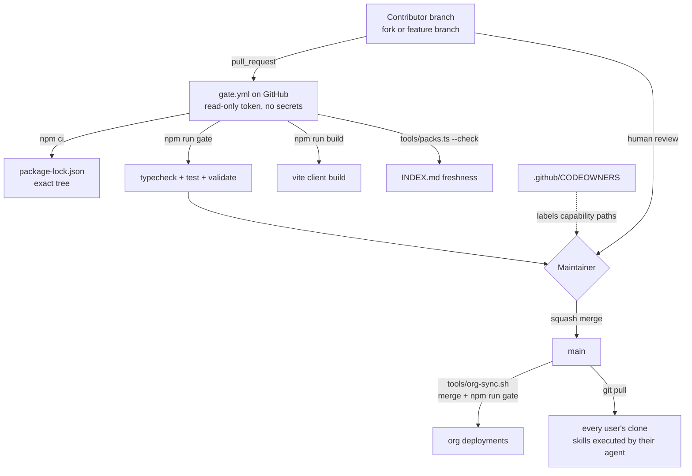

# Supply-chain spec: what running a contribution costs

*Status: current as of v1.4. Canonical formats owned elsewhere: the contribution
procedure and the gate commands in [CONTRIBUTING.md](../../CONTRIBUTING.md); the pack
safety checks in [validation.md](validation.md); the community tier's trust rules in
[community.md](community.md).*

## Purpose

Meno invites strangers to send pull requests against a repository whose contents are, by
design, executed: `tools/` runs on a maintainer's machine during the gate, `.agents/skills/`
is read and followed by an agent holding tool access, and `tools/org-sync.sh` merges this
repository into private org deployments and runs the gate there. That makes reviewing a
contribution an act of execution, not just of reading. This spec states where the trust
boundary sits, what enforces it, and - the part that matters most - which parts of it are
enforced by a machine and which rest on a human reading a diff.

Without it, the gate is a set of checkboxes a contributor ticks about work they did on
their own machine, and every documented invariant is honor-system.

## How it behaves

1. **The gate runs on GitHub, not on the maintainer's machine.**
   `.github/workflows/gate.yml` runs `npm ci`, `npm run gate`, `npm run build`, and
   `node tools/packs.ts --check` on every pull request and every push to `main`. The
   maintainer never has to execute an unreviewed branch locally to learn whether it is
   green.
2. **CI runs the contributor's command, verbatim.** The workflow invokes
   `npm run gate`, the same script CONTRIBUTING.md documents. If CI and the local gate
   diverge, contributors stop trusting the local one, so they are kept identical by
   construction rather than by discipline.
3. **The workflow is `pull_request`, never `pull_request_target`.** A fork's branch runs
   with a read-only token and no repository secrets. `pull_request_target` would run the
   same untrusted code with write scope, which is the standard way this exact setup is
   compromised.
4. **Dependencies install from the lockfile only.** `npm ci` fails on any drift between
   `package.json` and `package-lock.json`, so a pull request cannot resolve a dependency
   tree different from the one under review.
5. **Actions are pinned to commit shas.** A version tag is mutable; a moved tag is the
   cheapest available supply-chain attack. The tag stays in a trailing comment for
   legibility.
6. **`CODEOWNERS` names the capability-bearing paths.** `.github/`, `package.json`,
   `package-lock.json`, `app/client/vite.config.ts`, `tools/`, `.agents/skills/`,
   `.claude/`, the entry-point markdown, `schemas/`, and the tsconfigs. Solo, this labels
   them in the review UI and records which diffs must be read as code; it does not yet
   block, because GitHub does not permit self-approval and a required code-owner review
   would make `main` unmergeable for a single maintainer.
7. **Repository-level checks run outside the workflow.** Secret scanning with push
   protection (a credential is blocked at `git push`, not reported after it is public),
   Dependabot alerts and security updates, and private vulnerability reporting are all
   enabled on the repository. They are settings, not files, so they are recorded here -
   nothing in the tree would show they are on, and nothing in CI would notice if one were
   turned off.
8. **A vulnerability has a private channel.** [SECURITY.md](../../SECURITY.md) routes
   reports to a draft advisory rather than a public issue, states the threat model, and
   points at this spec's "Verified by" section so a known gap is not re-reported as news.
   Everything here is cloned and run locally, so a public report is a working exploit
   against every instance before anyone can update.
9. **Degraded path: CI cannot run the eval gate.** `npm run eval` shells out to the
   `claude` CLI, which no runner has. The eval gate stays a manual, reported step under
   CONTRIBUTING.md, and CI makes no claim about it.
10. **A green gate is not a safety verdict.** It proves the change typechecks, passes the
   tests, and validates. It proves nothing about whether `tools/test/a.test.ts` also
   read `~/.ssh`, or whether a sentence added to a skill instructs an agent to. The
   invariants below say exactly which of those a machine checks.

## Architecture

- `.github/workflows/gate.yml` - the enforcement point; the only place a check is
  mandatory rather than attested.
- `.github/CODEOWNERS` - the capability-path inventory.
- `.github/pull_request_template.md` - the attestations CI cannot make (sanitization,
  eval runs, smoke tests).
- `SECURITY.md` - the private reporting channel, the threat model, and the scope
  boundaries a reporter needs before deciding whether something is worth writing up.
- Repository settings (not files): secret scanning + push protection, Dependabot alerts +
  security updates, private vulnerability reporting.
- `tools/validate.ts`'s `pack-safety` - the only content scanner, scoped to
  `content/community/` and `content/org/` ([validation.md](validation.md)).
- `tools/org-sync.sh` - the downstream amplifier: whatever lands on `main` is merged and
  executed by every org deployment that syncs.

## Data touched

| Path | Access | Owner | Format |
|---|---|---|---|
| `.github/workflows/gate.yml` | read (executed by GitHub Actions) | this spec | workflow YAML |
| `.github/CODEOWNERS` | read (GitHub) | this spec | CODEOWNERS syntax |
| `package-lock.json` | read (`npm ci`) | npm | lockfile v3 |
| `content/community/INDEX.md` | read (`--check` compares, never writes in CI) | `tools/packs.ts` | generated |

## Invariants

1. The gate workflow triggers on `pull_request`, never `pull_request_target`, and
   declares `permissions: contents: read`.
2. Every third-party action is pinned to a full commit sha.
3. CI installs with `npm ci`, never `npm install`.
4. The command CI runs to gate a change is the same `npm run gate` CONTRIBUTING.md tells
   a contributor to run.
5. No workflow checks out a contributor's branch and then uses a write-scoped token in
   the same job.
6. Every path listed in `CODEOWNERS` is a path whose contents are executed, followed as
   instructions, or resolve dependencies.
7. The repository has secret scanning with push protection, Dependabot alerts and
   security updates, and private vulnerability reporting enabled.
8. A gap named in this spec's "Verified by" is also reachable from `SECURITY.md`, so a
   reporter can tell a known gap from a new one.

## Verified by

- Invariants 1-4: readable in `.github/workflows/gate.yml`; not machine-verified. A
  future pull request that adds a second workflow could violate 1, 2, or 5 and nothing
  would fail. `actionlint` in the gate would close this; deliberately deferred rather
  than pretended.
- Invariant 5: by construction - there is exactly one workflow, and it holds no secrets.
- Invariant 6: by inspection, restated in the file's own comments.
- Invariant 7: not machine-verified and not verifiable from the tree - these are
  repository settings, so nothing in a clone reveals whether they are on and no check
  would fail if one were switched off. Confirm with
  `gh api repos/<owner>/meno --jq .security_and_analysis` and
  `gh api repos/<owner>/meno/private-vulnerability-reporting`. A fork inherits none of
  them.
- Invariant 8: by inspection - `SECURITY.md`'s "Already known, and tracked" section links
  here rather than restating the gaps, so the two cannot drift apart.
- **Not verified, and named here so it is not mistaken for covered:**
  - `.agents/skills/**` is scanned by nothing. `pack-safety`'s error patterns
    (curl-pipe-to-shell, `process.env`, `~/.ssh`, credential shapes) apply only under
    `content/community/` and `content/org/`. A malicious instruction added to a skill is caught by
    human review or not at all. This is the largest open hole in the repository and is
    tracked as open question 1.
  - `pack-safety`'s instruction-shaped-phrase patterns are warnings, and `npm run gate`
    does not pass `--strict`, so they do not block a merge
    ([validation.md](validation.md); [community.md](community.md) invariant 7 records
    the procedural half as unverified).
  - A cited URL is reviewed at the time the pull request is read and fetched by an agent
    at some later time. Nothing detects a page whose contents change after merge.
  - `npm run build` executes `app/client/vite.config.ts`, and `npm test` globs and
    executes every file under `tools/test/` and `app/test/`. Both are contained in CI;
    neither is contained when a maintainer runs the gate locally on an unreviewed
    branch, which is why CONTRIBUTING.md says not to.

## Open questions

1. Whether `pack-safety`'s file scan should extend to `.agents/skills/**` (at minimum
   the error-level patterns, plus a warning on any newly introduced URL) - the mechanical
   half of the largest unverified gap above. Deferred out of this change only to keep a
   validate behavior change out of a CI change.
2. Whether the gate should run `npm run validate -- --strict` so pack warnings block,
   which turns three easily-paraphrased regexes into a merge gate and may buy less than
   it costs in false positives. Revisit after the first adversarial pack pull request.
3. Whether to add `actionlint` and a check that no workflow other than `gate.yml`
   exists - revisit if a second workflow is ever needed.
4. Whether required code-owner review turns on - answerable only when a second
   maintainer exists.
