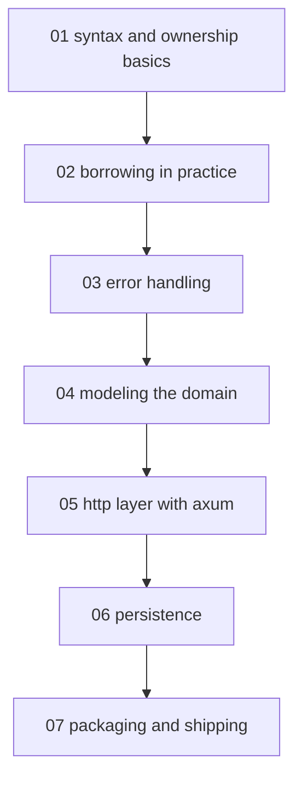

# Rust for backend - map

Contract: [[profile|Learning contract]]

<!-- meno:derived:start -->

**01 syntax and ownership basics** (generated)
- [[modules/01-syntax-and-ownership-basics/01-cargo-and-toolchain|Cargo and the Rust toolchain]] - one command replaces pip/npm's multi-step project setup
- [[modules/01-syntax-and-ownership-basics/02-syntax-for-experienced-developers|Rust syntax for Python and TypeScript developers]] - maps variables, functions, and control flow you already know onto Rust's stricter syntax
- [[modules/01-syntax-and-ownership-basics/03-ownership|Ownership]] - the one idea with no Python/TypeScript analogue, and the whole reason the link-shortener won't need a garbage collector
**02 borrowing in practice** (generated)
- [[modules/02-borrowing-in-practice/01-borrowing|Borrowing and references]] - swaps ownership-transferring functions for `&`/`&mut` borrows so the link-shortener stops needlessly cloning data
- [[modules/02-borrowing-in-practice/02-lifetimes|Lifetimes]] - the annotation that tells the compiler which input a returned reference is tied to, without ever changing how long anything actually lives
**03 error handling** (planned)
**04 modeling the domain** (planned)
**05 http layer with axum** (planned)
**06 persistence** (planned)
**07 packaging and shipping** (planned)
<!-- meno:derived:end -->

## My notes
(human territory; never regenerated)
