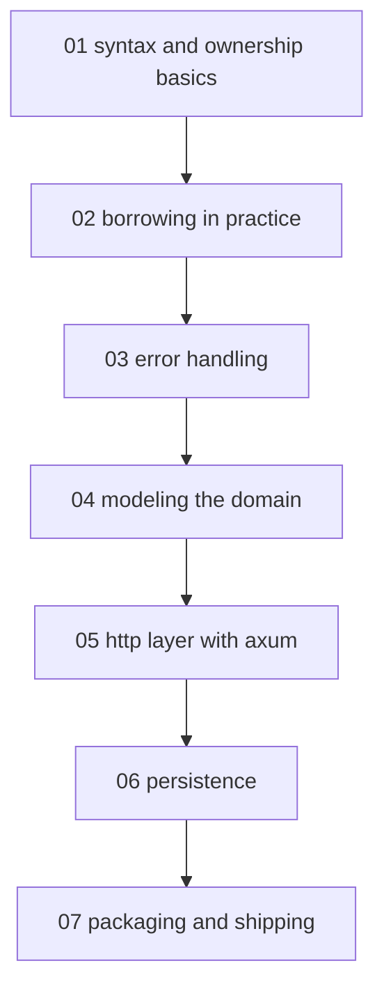

# Rust for backend - map

Contract: [[profile|Learning contract]]

<!-- meno:derived:start -->

**01 syntax and ownership basics** (planned)
**02 borrowing in practice** (planned)
**03 error handling** (planned)
**04 modeling the domain** (planned)
**05 http layer with axum** (planned)
**06 persistence** (planned)
**07 packaging and shipping** (planned)
<!-- meno:derived:end -->

## My notes
(human territory; never regenerated)
