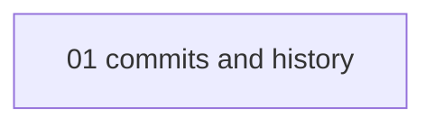

# Git fundamentals - map

<!-- meno:derived:start -->

**01 commits and history** (planned)
<!-- meno:derived:end -->

## Connects to
<!-- meno:connects:start -->
- [[rust-for-backend-hub|Rust for backend]] - merging to the default branch is what triggers a redeploy of the service you build in Rust
<!-- meno:connects:end -->

## My notes
(human territory; never regenerated)
