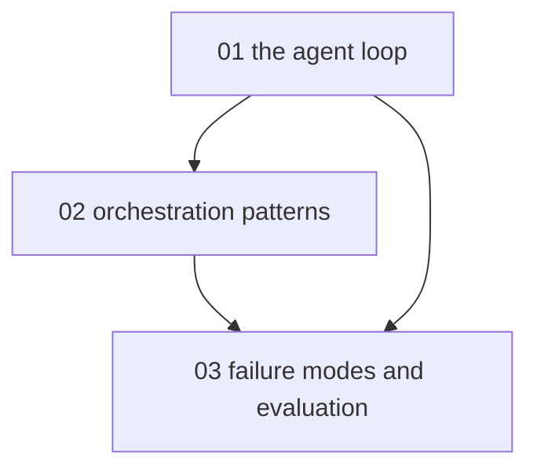

# Understanding LLM agents - map

<!-- meno:derived:start -->

**01 the agent loop** (planned)
**02 orchestration patterns** (planned)
**03 failure modes and evaluation** (planned)
<!-- meno:derived:end -->

## My notes
(human territory; never regenerated)
