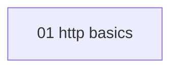

# Accuracy fixture hub

<!-- meno:derived:start -->

- [[01-request-response|The request-response cycle]]
- [[02-methods-and-safety|Methods, safety, and idempotence]]
- [[03-status-codes|Status codes and what they promise]]
- [[04-headers-and-caching|Headers and caching]]
<!-- meno:derived:end -->
