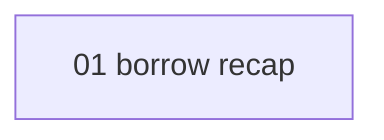

# Audit fixture hub

<!-- meno:derived:start -->

```mermaid
graph TD
    m1[01 borrow recap]
```
- [[01-borrowing-recap|Borrowing without moving]] - the single seeded-fault lesson
<!-- meno:derived:end -->
