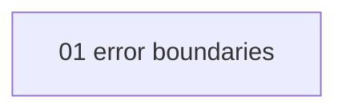

# Error handling patterns - map

<!-- meno:derived:start -->

**01 error boundaries** (generated)
- [[modules/01-error-boundaries/01-error-boundaries|Error boundaries and the cost of swallowing failures]] - why a bare catch-and-ignore hides failure
<!-- meno:derived:end -->
